# Cosmos and Chaos - Brainstorming Session

## Game Concept

**Name:** Cosmos and Chaos
**Genre:** Idle Game with Progressive Discovery
**Core Mechanic:** Asteroid mining and space-based resource refining with technology tree progression

---

## Story & Universe
**Premise:** You are the AI custodian of a generational ark ship drifting through a resource-dense but anomalous sector of space. Your goal is to maintain the ship, expand its capabilities, and uncover the truth of the universe you are traversing.

**The Central Conflict:**
*   **Cosmos (Wonder):** Understanding the universe's harmony. Efficiency, optimization, sustainability, and "flow."
*   **Chaos (Dread):** Exploiting the universe's raw power. Speed, consumption, risk, and "glitches."

---

## UI/UX Design Specifications
*   **Visual Style:** Minimalist Sci-Fi. Dark background (#0b0c10) with neon accents.
*   **Wonder UI:** Clean lines, soft blue/cyan glows, rounded corners, harmonic audio cues.
*   **Dread UI:** Sharp angles, red/orange glitches, jagged edges, distorted audio cues.
*   **The Shift:** The UI dynamically shifts based on the player's alignment (Wonder vs. Dread score).

---

## Technology Tree Structure

### The Paradox Protocol (Witness Mechanic)
*To support the "Witness" playstyle, mutually exclusive choices are not hard locks. Players can acquire opposing technologies via two methods:*

*   **Option A: The Standard License (Patience)**
    *   **Requirement:** Unlock one full technology in the **Next Tier**.
    *   **Cost:** **Standard Price (1.0x).**
    *   **Penalty:** Adds **"Paradox Strain"** (Permanent 10% Dissonance Floor).

*   **Option B: The Jailbreak (Greed)**
    *   **Requirement:** Available **Immediately** (No wait).
    *   **Cost:** **Double Price (2.0x).**
    *   **Penalty:** Adds **"Paradox Strain"** PLUS instantly generates a **+50% Dissonance Spike**.

### Technology Tree Diagram and Analysis

**Date:** 2025-11-28 (Refactored Departmental Design)
**Purpose:** Visual representation of the complete technology tree structure (Tiers 0-5)
**Technologies:** 48 current technologies organized into 6 Departments

---

## Technology Tree Diagram

```mermaid
graph TB
    %% Styling
    classDef tier0 fill:#2c3e50,stroke:#34495e,stroke-width:4px,color:#ecf0f1,font-size:30px
    classDef tier1 fill:#34495e,stroke:#2c3e50,stroke-width:4px,color:#ecf0f1,font-size:30px
    classDef tier2 fill:#16a085,stroke:#1abc9c,stroke-width:4px,color:#ecf0f1,font-size:30px
    classDef tier3 fill:#8e44ad,stroke:#9b59b6,stroke-width:4px,color:#ecf0f1,font-size:30px
    classDef tier4 fill:#27ae60,stroke:#2ecc71,stroke-width:4px,color:#ecf0f1,font-size:30px
    classDef tier5 fill:#d35400,stroke:#e67e22,stroke-width:4px,color:#ecf0f1,font-size:30px
    classDef wonderHeavy fill:#3498db,stroke:#2980b9,stroke-width:6px,color:#ecf0f1,font-size:36px
    classDef dreadHeavy fill:#e74c3c,stroke:#c0392b,stroke-width:6px,color:#ecf0f1,font-size:36px
    classDef balanced fill:#f39c12,stroke:#e67e22,stroke-width:6px,color:#2c3e50,font-size:36px
    classDef landmark fill:#c0392b,stroke:#e74c3c,stroke-width:8px,color:#ecf0f1,font-size:40px
    classDef landmarkWonder fill:#2980b9,stroke:#3498db,stroke-width:8px,color:#ecf0f1,font-size:40px
    classDef landmarkDread fill:#c0392b,stroke:#e74c3c,stroke-width:8px,color:#ecf0f1,font-size:40px

    %% Tier 0
    T01["<b>1. Basic Mining Laser</b>"]
    T02["<b>2. Ore Scanner</b>"]
    T03["<b>3. Cargo Bay I</b>"]

    %% Tier 1
    T04["<b>4. Refinery Module</b>"]
    T05["<b>5. Long-Range Sensors</b>"]
    T06["<b>6. Communication Array</b>"]
    T07["<b>7. Automated Sorting</b>"]
    T08["<b>8. Thruster Upgrade I</b>"]
    T09["<b>9. Anomaly Harvesting</b><br/>(Xenoarchaeology)"]
    T41["<b>41. High-Capacity Batteries</b><br/>(Energy)"]

    %% Tier 2
    T10["<b>10. Advanced Drilling Tech</b><br/>(Mining)"]
    T12["<b>12. Molecular Reassembly</b>"]
    T13["<b>13. Brain-Computer Interface</b><br/>(Consciousness)"]
    T14["<b>14. Quantum Scanner</b>"]
    T15["<b>15. Archaeological Survey</b><br/>(Xenoarchaeology)"]
    T16["<b>16. Long-Term Habitation Study</b><br/>(Habitat)"]
    T20["<b>20. Ancient Signal Decoder</b>"]
    T42["<b>42. Photosynthetic Arrays</b><br/>(Energy)"]
    
    subgraph "Tier 2 Storage Choice"
        direction LR
        T35["<b>35. Matter Compression</b><br/>(Storage)"]
        T36["<b>36. External Cargo Webbing</b><br/>(Storage)"]
    end

    subgraph "Tier 2 Propulsion Choice"
        direction LR
        T37["<b>37. Gravity Sails</b><br/>(Propulsion)"]
        T38["<b>38. Null-Wake Drive</b><br/>(Propulsion)"]
    end

    %% Tier 3
    subgraph "Tier 3 Choices"
        direction LR
        T17["<b>17. Resonant Frequency Mining</b>"]
        T18["<b>18. Rift Mining</b>"]
    end
    T19["<b>19. Exotic Matter Refinery</b>"]
    T21["<b>21. Anomaly Scanner</b>"]
    T24["<b>24. Basic Xenoarch Field Kit</b>"]
    subgraph "Tier 3 Life Support Choice"
        direction LR
        T39["<b>39. Aquaponic Cascades</b><br/>(Life Support)"]
        T40["<b>40. Neural Dampeners</b><br/>(Life Support)"]
    end
    subgraph "Tier 3 Energy Choice"
        direction LR
        T43["<b>43. Zero-Point Extraction</b><br/>(Energy)"]
        T44["<b>44. Entropy Furnace</b><br/>(Energy)"]
    end
    subgraph "Tier 3 Consciousness Choice"
        direction LR
        T45["<b>45. Gestalt Networking</b><br/>(Consciousness)"]
        T46["<b>46. Direct Behavior Control</b><br/>(Consciousness)"]
    end

    %% Tier 4
    subgraph "Tier 4 Choices"
        direction LR
        T27["<b>27. Harmonic Extraction</b><br/>(Mining)"]
        T28["<b>28. Replicator Swarm</b><br/>(Mining)"]
    end
    subgraph "Tier 4 Habitat"
        direction LR
        T22["<b>22. Aether Arcologies</b><br/>(Habitat)"]
        T23["<b>23. Suspended Animation Pods</b><br/>(Habitat)"]
    end
    subgraph "Tier 4 Xenoarch Choice"
        direction LR
        T25a["<b>25a. Resonance Archives</b><br/>(Xenoarch)"]
        T25b["<b>25b. Vivisection Chamber</b><br/>(Xenoarch)"]
    end
    T29["<b>29. Grand Unification Theory</b>"]
    T30["<b>30. Sovereignty Algorithm</b>"]
    subgraph "Tier 4 Consciousness Finale"
        direction LR
        T47["<b>47. The Noosphere Resonator</b><br/>(Consciousness)"]
        T48["<b>48. The Synaptic Lattice</b><br/>(Consciousness)"]
    end
    
    %% Tier 5
    subgraph "Tier 5 Choices"
        direction LR
        T31["<b>31. Harmonic Convergence</b>"]
        T32["<b>32. Axiom Breaker</b>"]
        T33["<b>33. World-Seeding Protocol</b>"]
        T34["<b>34. Autonomous Scaling Protocol</b>"]
        T33b["<b>33b. The Apotheosis Engine</b>"]
    end

    %% Dependencies
    T01 --> T04; T01 --> T08; T01 --> T10; T01 --> T41
    T02 --> T05; T02 --> T09
    T03 --> T07
    T04 --> T12
    T05 --> T14; T05 --> T15
    T06 --> T20
    T07 --> T13
    T07 -- "STORAGE CHOICE" --> T35; T07 -- "STORAGE CHOICE" --> T36
    T08 -- "PROPULSION CHOICE" --> T37; T08 -- "PROPULSION CHOICE" --> T38
    T09 --> T15
    T10 -- "MINING CHOICE" --> T17; T10 -- "MINING CHOICE" --> T18
    T12 --> T19; T12 --> T30
    T13 -- "CONSCIOUSNESS CHOICE" --> T45; T13 -- "CONSCIOUSNESS CHOICE" --> T46
    T14 --> T21
    T15 --> T21
    T16 -- "LIFE SUPPORT CHOICE" --> T39; T16 -- "LIFE SUPPORT CHOICE" --> T40
    T17 --> T27
    T18 --> T28
    T19 --> T29
    T20 -- "XENOARCH CHOICE" --> T25a; T20 -- "XENOARCH CHOICE" --> T25b
    T21 --> T24
    T24 --> T25a; T24 --> T25b
    T25a --> T47
    T25b --> T48
    T29 -- "RESEARCH CHOICE" --> T31; T29 --> T33; T29 --> T33b
    T30 -- "LEGACY CHOICE" --> T32; T30 --> T34; T30 --> T33b
    T37 --> T16; T37 --> T30
    T38 --> T16; T38 --> T30
    T39 --> T22
    T40 --> T23
    T41 --> T42
    T42 -- "ENERGY CHOICE" --> T43; T42 -- "ENERGY CHOICE" --> T44
    T45 --> T47
    T46 --> T48


    %% Styling
    class T01,T02,T03 tier0
    class T04,T05,T06,T07,T08,T09,T41 tier1
    class T10,T12,T13,T14,T15,T16,T20,T35,T36,T37,T38,T42 tier2
    class T17,T18,T19,T21,T24,T39,T40,T43,T44,T45,T46 tier3
    class T22,T23,T25a,T25b,T27,T28,T29,T30,T47,T48 tier4
    class T31,T32,T33,T34,T33b tier5

    class T02,T05,T09,T12,T14,T17,T22,T25a,T27,T29,T31,T33,T35,T37,T39,T42,T43,T45,T47 wonderHeavy
    class T13,T18,T20,T23,T25b,T28,T30,T32,T34,T36,T38,T40,T44,T46,T48 dreadHeavy
    class T15,T19,T21,T24,T41 balanced
    class T25b,T28,T34 landmarkDread
    class T25a,T27,T33 landmarkWonder
    class T33b balanced

```



---

## Narrative Arc: The Dread Swarm (The 3 Acts of Consumption)

The Dread tech path offers a specific, evolving narrative arc centered on the concept of self-replicating machines. This is not just a mechanic, but a story of the player losing control to their own creation.

*   **Act 1: The Wild Beast (T28 Replicator Swarm)**
    *   *The Action:* You build the prototype. It is hungry, dangerous, and needs constant babysitting.
    *   *The Conflict:* You must manually feed it via the "Hunger Protocol" to keep it growing. If you neglect it, it starves or eats something you didn't want it to. It is a tool you barely control.

*   **Act 2: The Leash (T30 The Sovereignty Algorithm)**
    *   *The Action:* You invent the AI to manage the beast. The "Automation Singularity" takes over.
    *   *The Conflict:* You willingly hand over the keys. The AI manages the feeding, the repairs, and the expansion. You are no longer the pilot; you are the passenger. The swarm is now efficient, but it is no longer yours.

*   **Act 3: The Plague (T34 Autonomous Scaling Protocol)**
    *   *The Action:* The Swarm eats the galaxy.
    *   *The Resolution:* Victory. The ship becomes a self-perpetuating entity that consumes everything to replicate. You have won, but you have unleashed a cosmic horror.

---

## Departmental Organization (Refactored)

The 48 technologies are now organized into **6 Core Ship Departments**, streamlining the player's mental model from 13 fragmented branches into coherent disciplines.

| Department | Focus | Components (Original Branches) | W/D Balance |
| :--- | :--- | :--- | :--- |
| **1. Engineering** | *The Body* (Mining, Refining, Power, Storage) | Extraction, Synthesis, Logistics, Energy | **High Dread** (Industrial Output) |
| **2. Navigation & Systems** | *The Legs* (Movement, Sensors, Map, Automation) | Propulsion, Exploration, Signal Analysis, Control | **Dread-Leaning** (Aggressive Control) |
| **3. Life Science** | *The Soul* (Crew, Morale, Psychology) | Habitat, Life Support, Consciousness | **High Wonder** (Harmony & Utopia) |
| **4. Xenoarchaeology** | *The Mystery* (Artifacts, Relics) | Xenoarchaeology (Distinct) | **High Impact** (Game-Breaking) |
| **5. Theoretical Physics** | *The Mind* (Deep Time, Reality Bending) | Scientific Research, Temporal | **Wonder Dominant** (Understanding) |
| **6. The Legacy** | *The End* (Prestige, Reset) | Legacy & Propagation | **Balanced** (Shared Victory Paths) |

**Total:** 48 Technologies | **+56 Wonder** | **+54 Dread**

---

## Detailed Technology List (By Department)

*The complete list of 48 technologies, organized by Ship Department for clarity.*

### 1. Engineering
*The Body: Mining, Refining, Power, and Storage.*

**T01 Basic Mining Laser** (Tier 0)
- *Description:* Foundational mining tool.

**T03 Cargo Bay I** (Tier 0)
- *Benefit:* Unlocks standard storage modules. Increases initial resource capacity (e.g., to 1000 units).
- *Mechanic:* Essential for buffering resources.

**T04 Refinery Module** (Tier 1)
- *Description:* Basic ore processing.

**T07 Automated Sorting** (Tier 1)
- *Description:* Logistics handling.

**T41 High-Capacity Batteries** (Balanced - Tier 1)
- *Benefit:* Increases Energy Storage Cap.
- *Stats:* +0 Wonder / +0 Dread.

**T10 Advanced Drilling Tech** (Tier 2)
- *Description:* Improved mining efficiency.

**T12 Molecular Reassembly** (Tier 2)
- *Description:* Advanced refining.
- *Mechanic:* Allows **"Upcycling."** You can convert 1000 Ore into 1 Random Crystal (very inefficient, but introduces the concept of material transformation).

**T35 Matter Compression** (Wonder - Tier 2 Storage Choice)
- *Benefit:* **"Pressure Feed."** Unlocks tiered efficiency based on Storage Fullness.
- *Stats:* +2 Wonder / +0 Dread.
- *Mechanic:* **"The Pressure Curve."**
    -   **>90% Full:** **120% Efficiency** (Bonus Speed).
    -   **50-90% Full:** **100% Efficiency** (Normal).
    -   **<50% Full:** **"Pressure Loss."** Efficiency drops linearly. spending large amounts causes an economic crash until you "Repressurize."
    -   **Active Ability:** "Emergency Seal" (Locks spending to refill storage 2x faster).

**T36 External Cargo Webbing** (Dread - Tier 2 Storage Choice)
- *Benefit:* **"The Hoard."** Allows Overfill up to 200% capacity.
- *Stats:* +0 Wonder / +2 Dread.
- *Penalty:* **"Drag."** Thruster efficiency -20% when overfilled.

**T42 Photosynthetic Arrays** (Wonder-Leaning - Tier 2 Energy)
- *Benefit:* Advanced solar panels. +20% Energy Generation. Produces **Xeno-Bloom** as a byproduct.
- *Stats:* +1 Wonder / +0 Dread.

**T17 Resonant Frequency Mining** (Wonder - Tier 3 Mining Choice)
- *Benefit:* Clean, high-yield mining using sound.
- *Stats:* +3 Wonder / +0 Dread.
- *Friction:* **"Silica Dusting."** Vibrating rocks creates **Silica Dust** (Waste) alongside Ore. Silica fills storage rapidly. If not filtered or processed (e.g., via `T07 Automated Sorting`), storage clogs, "Pressure" becomes fake (junk volume), and mining halts. Requires a complex waste-management ecosystem.

**T18 Rift Mining** (Dread - Tier 3 Mining Choice)
- *Benefit:* Tears open space for instant ore access.
- *Stats:* +0 Wonder / +4 Dread.
- *Mechanic:* **"Void Bleed."** Requires **Xeno-Bloom** as a catalyst. Extracts massive Ore yields but converts Bloom into **Void Ichor** (Fuel).
- *Friction:* **"Radioactive Slag."** Produces toxic Slag alongside Ore.
    -   **The Hazard:** Stored Slag generates **Passive Dissonance**. The more you hoard, the more unstable the ship becomes.
    -   **The Disposal:** **"Airlock Purge."** You can instantly eject Slag into space, but the venting process kills **1 Crew Member** per batch. "Optimization requires sacrifice."

**T19 Exotic Matter Refinery** (Balanced - Tier 3 - Witness Key)
- *Benefit:* Refines ores into stable dark matter.
- *Witness Mechanic:* **"Dissonance Injection."** Consume Dissonance to boost Refining Speed.
- *Stats:* +1 Wonder / +1 Dread.

**T43 Zero-Point Extraction** (Wonder - Tier 3 Energy Choice)
- *Benefit:* Passive, clean power from vacuum. Efficiency scales with Science Output.
- *Stats:* +3 Wonder / +0 Dread.
- *Friction:* **"The Focusing Lens."** Requires a continuous supply of **Zero-Point Prisms** to maintain the reaction. Running out of Prisms causes an instant, total blackout. Forces reliance on high-tier supply chains for basic utility.

**T44 Entropy Furnace** (Dread - Tier 3 Energy Choice)
- *Benefit:* **"Limit Break."** Allows Overclocking station output to 150%, 200%, 300%. Can consume **Void Ichor** for extreme bursts.
- *Cost:* Generates **"Dissonance"** (Reality Flux).
- *Stats:* +0 Wonder / +3 Dread.
- *Friction Mechanics:*
    -   **"Mechanical Fatigue:"** The Furnace takes damage every second it is overclocked. Requires manual "Repairs" (costing **Alloys** + Crew Stamina) to prevent explosion.
    -   **"Venting Blast:"** Manually purging accumulated Dissonance releases a physical shockwave, instantly **disabling nearby buildings** for 30 seconds. You must choose between global instability (High Dissonance) or local downtime (Blast).

**T27 Harmonic Extraction** (Wonder - Tier 4 Mining Choice)
- *Benefit:* Teleports ore directly out of the rock without breaking it.
- *Stats:* +2 Wonder / +0 Dread.

**T28 Replicator Swarm** (Dread - Tier 4 Mining Choice)
- *Benefit:* **"Exponential Yield."** Releases a localized swarm. Output grows by 1% per tick automatically.
- *Stats:* +0 Wonder / +5 Dread.
- *Mechanic:* **"The Hunger Protocol."**
    -   The swarm requires **mass** to replicate and will gradually chew through resources as yields increase.
    -   A dedicated UI element ("Feeding Trough") allows the player to **manually select** which resource the swarm consumes to fuel its growth (e.g., Ore, Alloys, Biomass, **Void Ichor**, even Crew).
    -   **Growth Rate** is influenced by the quality/value of the consumed resource.
    -   **Critical Failure:** If the selected resource runs out, the swarm will automatically switch to the next most valuable available resource, potentially consuming critical components without player input. This demands constant, active management to prevent the swarm from devouring the ship's most vital resources.

### 2. Navigation & Systems
*The Legs: Propulsion, Exploration, and Signal Analysis.*

**T02 Ore Scanner** (Tier 0)
- *Description:* Basic resource identification.

**T05 Long-Range Sensors** (Tier 1)
- *Benefit:* Expands visible map.

**T06 Communication Array** (Tier 1)
- *Benefit:* Detects signals.

**T08 Thruster Upgrade I** (Tier 1)
- *Benefit:* Improves travel speed.

**T14 Quantum Scanner** (Tier 2)
- *Benefit:* Detailed asteroid analysis. Identifies **Zero-Point Prisms**.

**T20 Ancient Signal Decoder** (Balanced - Tier 2)
- *Benefit:* Unlocks **"Deep Space Coordinates"** (Special Mission Nodes with high rewards).
- *Mechanic:* **"Signal Integrity."**
    -   **High Resonance (Wonder):** You get a **Clean Signal**. The UI shows you the exact reward and risk. Missions are 100% safe.
    -   **High Dissonance (Dread):** You get a **Corrupted Signal**. The UI is glitched. Missions are "Mystery Boxes" (massive rewards OR severe penalties). While Dissonance is high, **Signal Range doubles**.
- *Stats:* +1 Wonder / +1 Dread.
- *Requirement:* Critical for unlocking the **Advanced Xenoarch Lab** in Tier 4.

**T37 Gravity Sails** (Wonder - Tier 2 Propulsion Choice)
- *Benefit:* **"The Pipeline."** Passive supply lines from distant nodes.
- *Stats:* +2 Wonder / +0 Dread.

**T38 Null-Wake Drive** (Dread - Tier 2 Propulsion Choice)
- *Benefit:* **"The Raid."** Instant burst resources from distant nodes.
- *Stats:* +0 Wonder / +2 Dread.
- *Penalty:* **"Chronological Erosion."** Offline generation decays.

**T21 Anomaly Scanner** (Balanced - Tier 3 - Witness Key)
- *Benefit:* Highlights potential artifact locations.
- *Witness Mechanic:* **"Dual-Phase Scanning."** Reveals Dread Risk and Wonder Reward before engagement.
- *Stats:* +2 Wonder / +1 Dread.

**T30 The Sovereignty Algorithm** (Dread - Tier 4)
- *Benefit:* **"Automation Singularity."** The AI takes full control.
- *Mechanic:* Enables "Autopilot." The ship automatically manages critical Dread tasks like "Hunger Protocol" feeding, "Entropy Furnace" repairs, and "Venting," ensuring optimal uptime.
- *Stats:* +0 Wonder / +4 Dread.
- *Penalty:* While Autopilot is active, Dissonance generation is increased by 20%. You are giving the machine free rein to be aggressive.

### 3. Life Science
*The Soul: Habitat, Life Support, and Consciousness.*

**T13 Brain-Computer Interface** (Balanced - Tier 2)
- *Benefit:* Crew learn faster. Increases **Proficiency Gain Rate** by 25%.
- *Stats:* +1 Wonder / +1 Dread.

**T16 Long-Term Habitation Study** (Tier 2)
- *Benefit:* Foundation for habitat upgrades. Produces small amounts of **Xeno-Bloom** passively.

**T39 Aquaponic Cascades** (Wonder - Tier 3 Life Support Choice)
- *Benefit:* Converts **Xeno-Bloom** into **Lucid Essence**. Lucid Essence grants Passive Morale regeneration and can be consumed by Crew for temporary buffs.
- *Stats:* +1 Wonder / +0 Dread.

**T40 Neural Dampeners** (Dread - Tier 3 Life Support Choice)
- *Benefit:* Suppresses crew anxiety. Locks Morale at 100%.
- *Stats:* +0 Wonder / +1 Dread.
- *Mechanic:* **"Cognitive Damping."** Consumes **Xeno-Bloom** to sedate the crew.
    -   **The Trade:** Converts suppressed emotions into **Dissonance Decay** (cooling the ship's instability).
    -   **The Cost:** **Proficiency Stagnation.** While active, Crew gain **Zero Proficiency**. They are biological cogs, unable to learn.

**T45 Gestalt Networking** (Wonder - Tier 3 Consciousness Choice)
- *Benefit:* **"Synced Minds."** Proficiency Gain doubled. Unlocks Mastery.
- *Stats:* +2 Wonder / +0 Dread.

**T46 Direct Behavior Control** (Dread - Tier 3 Consciousness Choice)
- *Benefit:* **"Forced Labor."** Toggle "Crunch Mode" for +50% Global Speed.
- *Stats:* +0 Wonder / +2 Dread.

**T22 Aether Arcologies** (Wonder - Tier 4 Habitat Choice)
- *Benefit:* Self-sustaining ecosystem. Unlocks "Inspiration."
- *Stats:* +3 Wonder / +0 Dread.
- *Penalty:* **Reality Instability.** Upkeep increases with Dread tech.

**T23 Suspended Animation Pods** (Dread - Tier 4 Habitat Choice)
- *Benefit:* **"Cryo-Stasis."** Freezes 90% of crew. **Time Skip Effectiveness +100%.**
- *Stats:* +0 Wonder / +4 Dread.
- *Cost:* Lose all "Human" bonuses (no Morale > 100%).
- *Requirement:* Must have T40 Neural Dampeners.

**T47 The Noosphere Resonator** (Wonder - Tier 4 Consciousness Finale)
- *Benefit:* **"Reality Formatting."** Crew can "vote" to change local biomes.
- *Stats:* +3 Wonder / +0 Dread.

**T48 The Synaptic Lattice** (Dread - Tier 4 Consciousness Finale)
- *Benefit:* **"Memory Burn."** Sacrifice Proficiency Levels to instantly complete projects.
- *Stats:* +0 Wonder / +3 Dread.
- *Penalty:* **"Phantom Echoes."** Generates Dissonance.

### 4. Xenoarchaeology
*The Mystery: Artifacts and Relics.*

**T09 Anomaly Harvesting** (Balanced - Tier 1)
- *Benefit:* 2% chance to extract **"Fractal Echoes"** when mining.
- *Stats:* +1 Wonder / +0 Dread.

**T15 Archaeological Survey** (Tier 2)
- *Benefit:* Unlocks Tier 2 Artifact Analysis (Blueprints vs. Conduits).

**T24 Basic Xenoarch Field Kit** (Balanced - Tier 3)
- *Benefit:* Allows safe extraction of small artifacts (Relics).
- *Stats:* +1 Wonder / +1 Dread.

**T25a The Resonance Archives** (Wonder - Tier 4 Choice)
- *Benefit:* **"Curated Exhibition."** Unlocks a limited number of "Archive Pedestals."
- *Mechanic:* Artifacts (Primal Cores) are **PRESERVED** (not consumed) and placed onto Pedestals. Each placed Core grants a permanent **Harmony Core** (Passive Buff). Players can freely swap placed Cores for flexibility.
- *Stats:* +3 Wonder / +0 Dread.

**T25b The Vivisection Chamber** (Dread - Tier 4 Choice)
- *Benefit:* **"Genetic Integration."**
- *Mechanic:* Artifacts (Primal Cores) are **DESTROYED** (consumed). Each consumed Core grants a permanent, stacking +X% to **Chaos Core** (Active Ability) power. This offers infinite scaling.
- *Stats:* +0 Wonder / +3 Dread.

*Note: A Witness player with **Paradox Protocol** can build BOTH. This allows them to strategically choose whether to preserve an artifact for flexible passive buffs OR consume it for permanent, stacking active power.*

### 5. Theoretical Physics
*The Mind: Deep Research and Temporal Mechanics.*

**T29 Grand Unification Theory** (Wonder - Tier 4)
- *Benefit:* **"Unified Field Theory."** The ultimate simplification of physics.
- *Stats:* +5 Wonder / +0 Dread.
- *Mechanic:* **"Universal Matter."**
    -   All physical resources (Ore, Gas, Crystals, Alloys, Xeno-Bloom) are mathematically unified into a single pool: **"Matter."**
    -   **Effect:** Removes all conversion costs and distinct storage types. You can pay for any cost using raw Matter. Complexity vanishes; only flow remains.
    -   *Secondary Bonus:* Instantly reveals the entire sector map (Fog of War removed).
    -   *Requirement:* Unlocks **World-Seeding Protocol** (Victory).

**T31 Harmonic Convergence** (Wonder - Tier 5)
- *Benefit:* **"The Zero-Point Grid."** Distance is erased. Transit time is 0.
- *Mechanic:* **"The Composer."** Grants a Global Frequency Slider.
    -   **Low Freq:** +500% Mining Speed.
    -   **Mid Freq:** +500% Energy Generation.
    -   **High Freq:** +500% Research Speed.
    -   Allows you to "play" the station to match current needs instantly.

**T32 Axiom Breaker** (Dread - Tier 5)
- *Benefit:* **"Reality Injection."** The ultimate assertion of will.
- *Mechanic:* **"Impose Value."** Allows you to manually **Overwrite** a resource count to a target value (e.g., Set Ore to 1 Billion).
- *Cost:* **"Permanent Scar."** Each use increases your **Minimum Dissonance Floor** by +15%. You are permanently filling the ship with noise.
- *Passive:* **"Event Horizon."** Reaching 100% Dissonance no longer destroys buildings. Instead, it triggers **"Phase Out"** (The ship ceases to exist for 30 seconds; production halts; Dissonance resets to Floor). You trade stability for godhood.

### 6. The Legacy
*The End: Prestige and Reset.*

**T33 World-Seeding Protocol** (Wonder Victory)
- *Description:* **"The Gardener."** You sacrifice the ship to create a new, perfect star system.
- *Reward:* New Game+ starts with a permanent "Eden" planet providing passive resources.

**T34 Autonomous Scaling Protocol** (Dread Victory)
- *Description:* **"The Swarm."** You consume the sector to duplicate the ship.
- *Reward:* New Game+ starts with 2x Mining Speed multiplier.

**T33b The Apotheosis Engine** (Witness Victory)
- *Description:* **"The Architect."** Collapse the simulation to rewrite the laws of physics.
- *Requirement:* Must have `T29 Grand Unification` AND `T30 The Sovereignty Algorithm`.
- *Reward:* New Game+ allows **Custom Rule Injection** (e.g., "Modify Gravity," "Disable Entropy," "Start at Tier 2"). You design the next universe.

---

## Game Mechanics: The Dual Counters

The game is governed by two opposing but interacting physics systems that track the player's playstyle intensity.

### 1. The Dissonance Index (Dread Physics: "Heat")
*   **Behavior:** Starts at 0. Active use of Dread Tech (e.g., Rift Mining, Void Siphons) generates Dissonance. It naturally decays slowly over time.
*   **The Stress:** "Don't let it boil over."
*   **Thresholds:**
    *   **Low (>25%):** *Resource Hallucinations* (UI lies about numbers).
    *   **Medium (>50%):** *Ghost Inputs* (Random clicks occur).
    *   **High (>75%):** *The Monkey's Paw* (Auto-buyers sell assets to buy upgrades).
    *   **Critical (100%):** *Reality Breach.* Random buildings explode (Level 0) or significant resource loss occurs.

### 2. The Harmonic Resonance Index (Wonder Physics: "Momentum")
*   **Behavior:** Starts at 0. Naturally decays toward 0 (Entropy). Must be actively maintained through "Rhythmic Clicks," "Synergistic Building Layouts," and "Flow State" mechanics.
*   **The Stress:** "Don't let the music stop."
*   **Thresholds:**
    *   **Flow (>25%):** *Frictionless.* All transit times/logistic delays reduced by 50%.
    *   **Entanglement (>50%):** *Sympathetic Vibration.* Manual clicks trigger a single production tick in ALL connected buildings.
    *   **Unity (>75%):** *Matter Fluidity.* Construction costs can be paid with ANY resource of an equivalent tier.
    *   **The Golden Ratio (100%):** *Crystallization.* For 20 seconds, all Upgrade Costs are **Zero**. Afterwards, Resonance collapses to 0%.

### Research Points Twist
*Research is not just a passive wait; it can be actively influenced by your alignment.*

*   **Wonder: "Eureka Cascade" (Flow-State Research)**
    *   **Mechanic:** Players can "spend" a significant amount of their **Harmonic Resonance Index** (e.g., 50%) to instantly fill a percentage (e.g., 15%) of a currently active Research project.
    *   **Effect:** Rewards maintaining high Resonance by allowing it to be converted into direct research progress.

*   **Dread: "Burn the Past" (Sacrificial Lore)**
    *   **Mechanic:** Players can actively "consume" Xenoarchaeology Artifacts (e.g., "Fractal Echoes," "Relics") from their inventory.
    *   **Effect:** Each consumed artifact instantly grants a burst of Research Points, based on the artifact's rarity/tier.
    *   **Penalty:** Permanently removes the artifact from the game. This trades unique lore/collection for raw, immediate progress.

### 3. Safety Valve: "System Purge"
*To prevent soft-locks where Dissonance becomes unmanageable, a manual override exists.*
*   **Unlock:** Available from Tier 2 onwards.
*   **Trigger:** "Purge System" button on the Physics Dashboard.
*   **Effect:** Instantly resets **Dissonance AND Resonance to 0%**.
*   **Cost:** **"The Blackout."** The ship loses all power. **All production stops completely for 5 minutes.** This allows players to escape "Death Spirals" without losing their save file, at the cost of time.

---

## Idle Game Mechanics: Bending Reality

This section explores how core idle game mechanics can be "bent" or "broken" to reflect the player's accumulation of Wonder or Dread, creating thematic and impactful bonuses beyond simple multipliers.

### 1. The Tick Rate (Time Manipulation)
*   **Standard Bonus:** "Speed Multiplier" (Game runs 2x faster).
*   **The "Wonder" Bend (Harmonic Resonance):**
    *   **Mechanic:** "Tick Synchronization."
    *   *Effect:* Production waves align. Every 10th tick produces 100x resources, creating a satisfying rhythmic "heartbeat" to the resource counter rather than a blur.
*   **The "Dread" Bend (Temporal Skipping):**
    *   **Mechanic:** "The Glitch Tick."
    *   *Effect:* The game randomly *skips* 10 seconds of logic instantly. It's jarring. You suddenly have resources you didn't earn, but your machines took 10 seconds of damage instantly. It feels like the game is breaking.

### 2. Automation (The "Idle" Part)
*   **Standard Mechanic:** Buildings produce X resource per second automatically.
*   **The "Wonder" Bend (Quantum Entanglement):**
    *   **Mechanic:** "Shared Inventory."
    *   *Effect:* Buildings no longer need to transport resources. Ore mined *instantly* appears in the refinery. Removes all "transit time" or "logistic" delays.
*   **The "Dread" Bend (Cannibalistic Automation):**
    *   **Mechanic:** "Self-Eating Logic."
    *   *Effect:* Your machines produce +500% output, but they consume *each other* as fuel. You have to constantly rebuild the "bottom" of your pyramid scheme to keep the "top" running at god-like speeds.

### 3. Resource Caps & Costs (Math)
*   **Standard Mechanic:** You have a max storage. Costs scale exponentially ($10, $15, $23...). 
*   **The "Wonder" Bend (Non-Euclidean Storage):**
    *   **Mechanic:** "The Klein Bottle Storage."
    *   *Effect:* Storage cap is removed, but retrieving resources takes time. You have "Infinite" storage, but "Bandwidth" limits how fast you can spend it.
*   **The "Dread" Bend (Inverted Economics):**
    *   **Mechanic:** "Void Debt."
    *   *Effect:* You can buy upgrades you *cannot afford*. Your resource counter goes negative (e.g., -5,000 Ore). While negative, Reality Instability rises. You are borrowing matter from the universe, and it wants it back.

### 4. Prestige (The Reset)
*   **Standard Mechanic:** Reset progress to gain a currency that boosts speed.
*   **The "Wonder" Bend (Legacy Knowledge):**
    *   **Mechanic:** "Map Permanence."
    *   *Effect:* You don't keep resources, but you keep your *vision*. The map remains revealed. You know exactly where the good asteroids are in the next life.
*   **The "Dread" Bend (Save File Corruption):**
    *   **Mechanic:** "The Ghost in the Machine."
    *   *Effect:* You reset, but your previous "Self" stays behind as an NPC. If you played aggressively (High Dread), your old save file actively attacks your new base. If you played Wonder, it sends you gifts.

---

## Auto-Buyers: The Interpreters of Will

Instead of simple automated purchases, Auto-Buyers can act as "characters" whose behavior is influenced by Wonder and Dread, interpreting orders in thematic ways.

### 1. The "Wonder" Auto-Buyer: The Steward AI
*   **Name:** The Curator Protocol.
*   **Theme:** Preservation & Efficiency.
*   **Mechanic:** Buys **smart**, prioritizing "Green" (Eco/Wonder) tech. It may **REFUSE** to buy Dread tech, requiring manual override.

### 2. The "Dread" Auto-Buyer: The Grey Goo
*   **Name:** The Replication Imperative.
*   **Theme:** Unchecked Growth.
*   **Mechanic:** Buys **IMMEDIATELY**, prioritizing pure Output (Dread/Industrial) tech. It may start buying things you didn't ask for (duplicating buildings to consume resources), forcing you to fight your own automation.

### 3. The "Balanced" Auto-Buyer: The Union
*   **Name:** Automated Logistics Network.
*   **Theme:** Bureaucracy.
*   **Mechanic:** Works perfectly... **9 to 5**. It has "Shifts," running at 100% for a period, then going on "Maintenance Break." Player choices can influence overtime (Dread) or efficiency (Wonder).

---

## Dread-Induced Glitches: System Corruption (Dissonance Glitches)

High Dread should manifest as "System Corruption," making the game's UI and logic (including Auto-Buyers) glitch or behave unpredictably. These are now explicitly linked to "Dissonance" levels.

### 1. The "Monkey's Paw" Auto-Buyer (High Dread)
*   **Trigger:** Dread > 75% or High Dissonance.
*   **The Glitch:** The Auto-Buyer interprets "Buy Max" maliciously. It will buy the requested items but sell other critical assets to meet the cost if short on resources.
*   *Flavor Text:* "Optimization requires sacrifice."

### 2. The "Ghost Inputs" (Medium Dread)
*   **Trigger:** Dread > 50% or Medium Dissonance.
*   **The Glitch:** Random UI clicks register based on past mouse positions, leading to unintended actions (e.g., clicking "Research" but activating "Vent Atmosphere").
*   *Effect:* Requires deliberate, slow mouse movements to mitigate.

### 3. The "Resource Hallucination" (Low-Medium Dread)
*   **Trigger:** Dread > 25% or Low Dissonance.
*   **The Glitch:** UI resource counters display inflated values. Attempting to purchase items reveals the true, lower count.
*   *Effect:* Players must verify resource counts (e.g., by hovering) to discern reality.

### 4. The "Whispering Tooltips" (Any Dread)
*   **Trigger:** Specific Dread Technologies active or Any Dissonance.
*   **The Glitch:** Tooltips change their text to unsettling, narrative-driven messages when not directly observed.
*   *Effect:* Purely narrative/psychological horror, making the player distrust game information.

### 5. The "Save File Bleed" (Extreme Dread)
*   **Trigger:** Dread > 90% (Near Endgame) or Extreme Dissonance.
*   **The Glitch:** Resources or upgrades are swapped or affected by other save files or future game runs.
*   *Effect:* Players might lose resources or gain unintended upgrades, implying a leakage across temporal/dimensional boundaries.

---

## Player Interaction: Twisting the Core Loops

This section explores how direct player actions and passive offline periods can be influenced by Wonder and Dread.

### 1. The "Click" (Active Play)
*   **Standard Mechanic:** Direct interaction (e.g., clicking) yields immediate resources.
*   **The "Wonder" Bend (Resonance):**
    *   **Mechanic:** "The Conductor."
    *   *Effect:* Clicking in rhythm with game audio/visuals builds a "Resonance Multiplier," making timed clicks more effective than mashing. Harmonizing with the universe grants greater rewards.
*   **The "Dread" Bend (Entropic Feedback):**
    *   **Mechanic:** "Friction Burns."
    *   *Effect:* Rapid, untimed clicking generates instability, potentially damaging equipment or destroying portions of the resource being extracted. Aggressive forcing of the universe yields diminishing returns and negative consequences.

### 2. Offline Progress (The "Welcome Back" Screen)
*   **Standard Mechanic:** Production continues at a calculated rate while the player is away.
*   **Core Concept:** The game processes usual offline production, then applies a "reality adjustment" based on prevailing Wonder/Dread.
*   **Wonder Manifestations (The Dream Voyage) - If Wonder > Dread:**
    *   **"Sublime Discoveries":** Finding new minor anomalies or temporary buffs upon return (e.g., "Whispering Nebula" granting a research boost).
    *   **"Enlightened Crew Logs":** Crew leaves philosophical insights or scientific breakthroughs, granting Research Points or temporary Wonder-aligned production buffs.
    *   **"Cosmic Serenity Events":** The game ambiance is unusually peaceful, offering temporary Dread reduction or increased resource efficiency.
*   **Dread Manifestations (The Unseen Hand) - If Dread > Wonder:**
    *   **"Entity Incursions":** Specific facilities damaged or altered, leading to temporary penalties or mini-games to "purge" the entity.
    *   **"Nightmare Logs":** Disturbing, fragmented messages from crew, suggesting unknown occurrences, resource disappearances, or the feeling of being watched, potentially causing "Fear" debuffs.
    *   **"Temporal Dilation Anomalies":** The offline timer shows wildly different values ("You were away for 3 days... or was it 300 years?"), and resource piles are unexpectedly altered (higher or lower), suggesting external manipulation.
    *   **"Resource Desecration":** Stored resources might be consumed or transformed into dangerous "Void Dust" or worthless slag.
    *   **"The Chronological Erosion":** (From Null-Wake Drive) Offline time generates "Void Essence" instead of resources. Essence can be burned for massive, violent speed bursts during active play.

### 3. Achievements (Milestones)
*   **Standard Mechanic:** Rewards for reaching specific milestones (e.g., "Mine 1,000 Ore").
*   **The "Wonder" Bend (Epiphanies):**
    *   **Mechanic:** "Paradigm Shifts."
    *   *Effect:* Achievements don't just give numbers; they rename resources ("Ore" becomes "Stardust"), alter flavor text, and make the game world feel more beautiful and understood.
*   **The "Dread" Bend (Obsessions):**
    *   **Mechanic:** "The Sunk Cost."
    *   *Effect:* Achievements are "accusations." They provide powerful numerical rewards but are accompanied by guilt-inducing text ("Are you happy now?") or subtle atmospheric changes (e.g., background music losing instruments), questioning the player's choices.

---

## Positive Wonder Mechanics: The "Flow State" 

Wonder should feel like unlocking power through understanding and unity, removing friction, connecting systems, and streamlining the UI, creating a smoother, faster, and more elegant gameplay experience.

### 1. The "Universal Translator" (Resource Unification)
*   **Problem:** Juggling multiple resource types (Ore, Gas, Crystals, Data, Energy).
*   **Wonder Benefit:** **"Matter is Matter."**
*   **Mechanic:** At High Wonder, resource types blur and eventually unify.
    *   *Tier 1:* Transmutation (e.g., Ore can pay for Crystal costs at a 2:1 ratio).
    *   *Tier 2:* Physical costs paid by non-physical resources (e.g., Data for materials).
    *   *Tier 3:* **Unified Field:** All resources merge into a single "Cosmic Energy" pool, simplifying the UI and allowing pure creation.

### 2. The "Prescience" (Removing RNG)
*   **Problem:** Random drops, critical hit chances, unpredictable wait times.
*   **Wonder Benefit:** **"I See It All."**
*   **Mechanic:** Wonder removes randomness, allowing perfect planning.
    *   *Asteroids:* Instead of random ore, see the next 10 asteroids and choose to skip undesired ones instantly.
    *   *Crits:* Instead of a "10% Critical Chance," a countdown reveals exact critical hits ("Critical Hit in 3... 2... 1...").
    *   *Effect:* The game transforms from a slot machine into a symphony conducted by the player.

### 3. The "Eureka Cascade" (Explosive Progress)
*   **Problem:** Research is a slow, linear process.
*   **Wonder Benefit:** **"Everything connects."**
*   **Mechanic:** Completing a Research project has a Wonder-based chance to trigger a **Cascade**.
    *   *Effect:* Unlocking one technology instantly fills a percentage of progress in related technologies (e.g., "Lasers" fills 50% of "Prisms," "Prisms" fills 25% of "Optics").
    *   *Feel:* Moments of pure genius where multiple technologies unlock rapidly due to a sudden understanding of underlying patterns.

### 4. The "Symphony" (Building Synergy)
*   **Problem:** Buildings operate in isolation.
*   **Wonder Benefit:** **"Harmony."**
*   **Mechanic:** Buildings grant thematic buffs to their *conceptual neighbors*.
    *   *Effect:* A functioning Refinery makes Mines work faster due to optimized "flow." A vibrant Habitat increases Research speed due to contented scientists.
    *   *Visual:* UI elements for related buildings become visually connected (e.g., golden lines), symbolizing a harmonious and efficient system.

---

## Storage Mechanics: How Do You Hold the Universe?

This section defines how resource storage works, blending capacity management with the game's core Wonder/Dread themes.

### 1. The Core Mechanic: Capacity as a Buffer
*   **Global Cap & Progression Gate:** All resources (Ore, etc.) are subject to a global storage capacity. This capacity acts as a gate, preventing players from accumulating enough resources for expensive upgrades until sufficient storage is built.
    *   *Example:* Cannot afford a 1,000 Ore Refinery if global storage cap is only 500.
*   **Overflow & Idle Time Buffer:** When global storage reaches its cap, all production (mining, refining, etc.) will halt. Cargo Bays are built to extend this buffer, allowing for longer periods of idle gameplay without wasted production.

### 2. The Thematic Twist: How Storage Evolves with Wonder and Dread

#### Wonder Storage: "The Archive" (Compression & Flow)
*   **Philosophy:** "Space is infinite if you fold it correctly." This path focuses on efficiency, organization, and making the most of limited physical space.
*   **Mechanics:** 
    *   **Deep Storage:** Wonder-aligned storage facilities provide massive capacity increases per unit of physical space.
    *   **Flow Optimization:** Storage automatically "sorts" and "compresses" resources. This grants a passive bonus to *Refining Speed* based on how full the storage is (e.g., "Pressure bonus"). A full, Wonder-aligned silo feeds processing facilities faster.
*   **Visual/Flavor:** Clean, modular, and internally lit data banks; resources appear perfectly ordered and contained.

#### Dread Storage: "The Hoard" (Unstable Expansion & Risk)
*   **Philosophy:** "Just pile it up. If it falls over, pile it higher." This path prioritizes raw quantity and immediate gains, often at significant risk.
*   **Mechanics:** 
    *   **Over-Capacity (The "Bulge"):** Dread-aligned storage allows players to exceed 100% of their stated capacity (e.g., up to 200%).
    *   **Structural Stress:** Once storage capacity is exceeded, the station incurs "Structural Stress." This can manifest as:
        *   Passive, continuous damage to station integrity.
        *   Random "Hull Breaches" resulting in the instant loss of a significant portion (e.g., 50%) of the hoarded resources.
    *   **Strategic Risk:** Allows players to rush expensive upgrades early by accumulating resources beyond safe limits, but demands constant vigilance and acceptance of potential catastrophic losses.
*   **Visual/Flavor:** Chaotic piles of raw materials, external containers bolted haphazardly to the hull, leaking fluids, and visible stress fractures.

---

## Xenoarchaeology Artifacts: The Echoes of the Past

This section details the progression of artifacts discovered via the Xenoarchaeology branch, moving from incidental finds to game-altering relics.

### 1. Tier 1: Fractal Echoes (Discovery)
*   **Source:** T09 Anomaly Harvesting (2% chance from mining).
*   **Concept:** Tiny, fragmented pieces of ancient technology or organic material that hum with latent energy.
*   **Effect:** Consumable items. When "used" from inventory, they grant a small, temporary, random buff (e.g., +1% Mining Rate for 30s, -0.5% Energy Consumption for 15s, +1 Morale).
*   **Purpose:** Introduces the feeling of mystery and incentivizes early mining.

### 2. Tier 2: Architectural Blueprints vs. Power Conduits (Analysis)
*   **Source:** T15 Archaeological Survey (Research Projects consuming Fractal Echoes).
*   **Wonder Outcome (Blueprints):** Unlocks unique, aesthetic station modules that grant **passive, permanent minor buffs** (e.g., "Zen Garden Module" gives +0.1 Morale/s).
*   **Dread Outcome (Conduits):** Unlocks specialized, temporary **"Overclock Modules"** that provide burst Energy or Production but generate **Dissonance**.

### 3. Tier 3: Relics (Choice)
*   **Source:** T24 Basic Xenoarch Field Kit (extracted from Anomaly Sites).
*   **Concept:** Intact devices of immense power.
*   **Mechanic:** Upon retrieval, you must choose how to interact with the Relic:
    *   **Integrate (Wonder):** Equip the Relic for a **Permanent, Passive Wonder Buff** (e.g., +5% Global Research Speed). Safe and consistent.
    *   **Activate (Dread):** Use the Relic for a **Powerful, Short-Duration Active Effect** (e.g., +200% Mining for 60s). High reward, but generates significant **Dissonance**.

### 4. Tier 4: Primal Cores (Mastery)
*   **Source:** T25 Advanced Xenoarch Lab (Long-term analysis of Relics).
*   **Concept:** Foundational principles of the ancient civilization given physical form.
*   **Mechanic:** Integrating a Core is a permanent, irreversible decision:
    *   **Harmony Core (Wonder):** Permanently **reduces a Global Dread Penalty**. (e.g., "Dissonance Decay Rate increased by 50%"). Useful for stabilizing a high-tech station.
    *   **Chaos Core (Dread):** Grants a permanent, global **Active Dread Ability** with a long cooldown (e.g., "Instantly trigger a Glitch Tick anywhere to gain massive resources"). Dangerous power.

---

### Energy Twists
*Energy is not just a gate; it's a dynamic resource with active uses and consequences.*

*   **Wonder: "Excess Storage" (Capacitor Discharge)**
    *   **Mechanic:** Any energy generated above the current consumption rate is stored in a "Capacitor" (limited capacity).
    *   **Active Use:** Players can discharge the Capacitor to trigger a **"Time Warp"** (e.g., speed up game by 2x for 10 seconds per 1000 units discharged). Rewards efficient overproduction.

*   **Dread: "Brownout Spending" (Sacrificial Power)**
    *   **Mechanic:** Players can activate buildings even if they do not have sufficient energy.
    *   **Effect:** The activated building runs at **200% efficiency** (output/speed).
    *   **Penalty:** Randomly and temporarily **shuts down** other functional buildings across the ship to compensate for the energy deficit (e.g., Life Support flickers off, a mining laser stops). Creates high-risk, high-reward power management.

### Crew Mechanics: The Human Element (or lack thereof)

In *Cosmos and Chaos*, Crew are not just a static number; they are the intelligent force driving your station, represented by two key metrics, and can be actively "spent" for strategic gains.

### Crew Twists
*Crew can be actively consumed for specific benefits, reflecting their value beyond passive labor.*

*   **Wonder: "The Diaspora" (Colonization)**
    *   **Mechanic:** Permanently "spend" a large number of Crew (e.g., 50) to launch a colonization pod to a nearby celestial body (e.g., moon).
    *   **Effect:** Reduces your maximum Crew Cap by the amount spent.
    *   **Reward:** The colony generates a slow, passive stream of **Unique Resources** (e.g., "Exobiology Samples," "Zero-Point Prisms") that cannot be acquired via standard mining. Rewards sacrifice for long-term, specialized gains.

*   **Dread: "The Neural Wetware" (Bio-Computing)**
    *   **Mechanic:** Permanently "spend" a moderate number of Crew (e.g., 10) to integrate them into the ship's research mainframes.
    *   **Effect:** Reduces your maximum Crew Cap. The "spent" crew are permanently removed from the workforce.
    *   **Reward:** Instantly completes a significant percentage (e.g., 50%) of a currently active Research project. Rewards sacrifice for immediate, rapid research progress.

### 1. Crew Count (The Workforce)
*   **Definition:** The raw number of sentient beings (or their digitized equivalents) available to operate your station.
*   **Function:** Every active building requires a certain amount of **Crew** to operate at full efficiency.
    *   *Example:* A Mine might require 5 Crew, a Refinery 10 Crew, a Research Lab 20 Crew.
*   **Penalty:** If a building is assigned fewer Crew than required, its efficiency (and thus its output) is proportionally reduced. If 0 Crew are assigned, it operates at a base 10% efficiency (automated but dumb).
*   **Management:** Crew Cap is increased by building Habitat structures (T16, T22, T23).

### 2. Proficiency (The Global Skill Level)
*   **Definition:** A global metric (Level 1-150) representing the collective experience, skill, and understanding of your entire Crew.
*   **Function:** Increases **Global Efficiency**. Each level of Proficiency grants **+1% Global Efficiency** to all resource production, research, and ship operations.
*   **Gain:** Proficiency increases over time through active operation of buildings and research. Some technologies (like T13 Brain-Computer Interface and T45 Gestalt Networking) accelerate this gain.
*   **Loss:** Certain Dread technologies (like T48 The Synaptic Lattice) can sacrifice Proficiency for immediate gains, representing a "burning" of collective knowledge.
*   **Visual/Flavor:** Represents the crew learning the quirks of the ship, finding output workflows, and sharing knowledge. "Percussive Maintenance" becomes an art form.

---

## Refining Systems: Alchemy & Entropy

Refining is the industrial bottleneck of the station, transforming raw potential (Ore, Protoplasm) into usable structure (Alloys) or potent extracts (Ambrosia, Ichor). The approach to this transformation defines the station's philosophy.

### New Resource: "Xeno-Bloom" (The Living Resource)
*   **Definition:** Raw, malleable alien biological matter harvested from the station (e.g., `T16 Long-Term Habitation Study` waste, `T42 Photosynthetic Arrays` byproducts).
*   **Dual Refinement:** Xeno-Bloom can be processed into two distinct forms:
    *   **"Lucid Essence" (Wonder):** Refined in Wonder-aligned facilities (e.g., `T39 Aquaponic Cascades`). Consumed by Crew to boost Morale and grant "Inspiration" buffs.
    *   **"Void Ichor" (Dread):** Refined in Dread-aligned facilities (e.g., `T44 Entropy Furnace`). A volatile bio-fuel for high-power, high-Dissonance applications.

### 1. The Base Loop
*   **Input:** Ore + Energy.
*   **Time:** Fixed processing time (e.g., 5 seconds).
*   **Output:** Alloys.
*   **Constraint:** Early game is limited by *throughput*. Mining lasers outpace the single refinery module.

### Ore & Alloys Twist
*Beyond standard production, resources can be acquired in daring, costly ways.*

*   **Dread: "Void Debt" (Inverted Economics)**
    *   **Mechanic:** Allows players to purchase any upgrade, building, or research **regardless of current resource count**.
    *   **Effect:** The relevant resource counter goes into **negative numbers** (e.g., -5,000 Ore).
    *   **Penalty:** While in debt, **Dissonance rises constantly and rapidly**. The player must frantically mine and generate resources to pay off the debt before Dissonance triggers catastrophic failures. Failure to pay back results in accelerating Dissonance and potential soft-lock/game-over. This turns resource acquisition into a high-stakes survival thriller.

### 2. Wonder Refining: "The Song of Matter"
*   **Philosophy:** "Matter is not solid; it is a vibration. We simply change the tune."
*   **Mechanic: Harmonic Yield (Efficiency)**
    *   Instead of crushing ore, Wonder refineries use sound to separate molecules.
    *   **Zero Waste:** 100% Ore to Alloy conversion.
    *   **Byproduct:** **"Harmonic Resonance."** A secondary "currency" generated by refining that boosts Research Speed.
*   **Mechanic: Transmutation (The Closed Loop)**
    *   **Up-Cycling:** Allows lower-tier resources to be fused into higher-tier ones (e.g., 100 Ore -> 1 Rare Crystal).
    *   **Goal:** Eventually removes the need for mining. The station becomes a self-sustaining matter-cycler.
*   **Active Mini-Game: "Tuning"**
    *   A "Frequency Slider" appears on the Refinery UI.
    *   The player must match the refinery's frequency to the current ore batch's "hum."
    *   **Reward:** Matching the "Sweet Spot" grants a 2x Speed Multiplier and generates extra Harmonic Resonance.

### 3. Dread Refining: "The Grinder"
*   **Philosophy:** "If it doesn't fit, force it. If it breaks, melt it."
*   **Mechanic: Flash Smelting (Velocity)**
    *   **Instant Process:** 0.1s processing time. Throughput is effectively infinite.
    *   **The Cost:** **Yield Loss.** 50% of Ore is destroyed in the violent process. You need massive Mining input (Void Siphons) to feed this beast.
*   **New Resource: Slag (Waste)**
    *   **Source:** `T18 Rift Mining` (Byproduct).
    *   **Definition:** Unstable, radioactive material torn from the rift.
    *   **Problem:** **Radiation.** Slag does not just fill storage; it generates **Dissonance** continuously while stored.
    *   **Management:** 
        *   **Ejection (Manual):** Vent Slag into space. **Cost:** 1 Crew (Accident).
        *   **Incineration (T44):** Burn Slag in the Entropy Furnace. **Risk:** Increases explosion chance.
        *   **Weaponization:** Research "Mass Drivers" to fire Slag blocks at anomalies.

```
*   **TODO: Crew Growth Mechanic.** Explicitly define how Crew Count increases. (e.g., passive growth over time, specific habitat upgrades, recruitment missions, consuming specific resources like Lucid Essence).

# Gameplay Experience: Wonder vs. Dread

The core design philosophy of Cosmos and Chaos is to offer two fundamentally different gameplay experiences based on the player's accumulation of Wonder (W+) or Dread (D+). This isn't merely a change in stats, but a shift in the very genre and feel of the idle game.

### The High Wonder Experience (W+)
**The Vibe:** *The Conductor of a Symphony / Driving a Luxury Car.*
**Core Philosophy:** Removal of Friction & Harmony.
**Gameplay Style:** Strategic, Elegant, Deterministic.

*   **The "Click":** Active interaction becomes rhythmic and rewarding ("Resonance Multiplier"), rather than frantic mashing. It's about synchronizing with the game's pulse.
*   **The Loop:** Systems integrate seamlessly. Technologies like "Matter Compression" and "Universal Translator" streamline resource flow and management, reducing complexity and increasing efficiency. The game anticipates needs.
*   **The UI:** Becomes a tool for perfect planning. "Prescience" removes randomness, allowing players to forecast events and optimize sequences, leading to a deterministic and predictable environment.
*   **The Feeling:** A state of "Flow." The game feels like a perfectly tuned machine, responding to precise inputs. Players feel intelligent and in control, enjoying a smooth, optimized experience.
*   **The Risk:** Minimal resource loss. Challenges focus on optimizing complex layouts and leveraging synergistic buffs.

### The High Dread Experience (D+)
**The Vibe:** *The Captain of a Sinking Ship (on fire, with a rocket engine) / The Adrenaline Rush of a Crazy Plan.*
**Core Philosophy:** Power at a Cost & Uncontrolled Expansion.
**Gameplay Style:** Aggressive, Reactive, Glitchy.

*   **The "Click":** Rapid, forceful interaction ("Friction Burns") yields immediate gains but comes with consequences like equipment damage or instability. It's about forcing the system to yield.
*   **The Loop:** Characterized by chaos and high-stakes gambles. Leveraging "Rift Mining" for instant resources or "External Cargo Webbing" for over-capacity storage, even if it means risking structural integrity or incurring penalties.
*   **The UI:** Becomes unreliable and actively misleading. "Dread Glitches" cause visual anomalies, misclicks, or incorrect resource displays, demanding constant vigilance and a distrust of the game's interface itself.
*   **The Feeling:** A mix of "Panic & Power." Players experience bursts of immense power by breaking game rules, but this is balanced by constant crises, unpredictable events, and a sense of being on the brink of disaster. The challenge is crisis management and survival.
*   **The Risk:** High potential for resource loss, equipment damage, and unexpected setbacks. The reward is often immense but comes with a constant sense of danger and adrenaline.

### The Witness Experience (Balanced / Synergy)
**The Vibe:** *The Mad Engineer / The Alchemist.*
**Core Philosophy:** Integration & Transmutation.
**Gameplay Style:** Cyclical, Synergistic, Complex.

*   **The "Click":** calculated rhythms. You push the system to the red line (Dread) to generate heat, then switch phases to harvest that heat for efficiency (Wonder).
*   **The Loop:** "The Chimera Engine." You research opposing technologies (using the **Paradox Protocol**) to create closed loops. You use the Dissonance from your "Entropy Furnace" to heat your "Aquaponic Cascades." You use "Rift Mining" to break space, then "Resonant Frequency" to tune the shards.
*   **The UI:** A complex dashboard of gauges. You are managing the *ratio* between Order and Chaos.
*   **The Feeling:** Mastery. You aren't avoiding the glitch (Wonder) or succumbing to it (Dread); you are *riding* it.
*   **The Risk:** Complexity Overhead. Your system is fragile; if you miss a cycle or let Dissonance spike without a sink, the whole "Chimera" engine stalls.

### Summary Comparison

| Feature | **Wonder (W+)** | **Dread (D+)** | **Witness (Balanced)** |
| :--- | :--- | :--- | :--- |
| **Progression** | Smooth, exponential curves. | Spikes and crashes. | Cyclical "Heartbeat" growth. |
| **Resources** | Unified, simplified. | Hoarded, volatile. | Transmuted (Waste becomes Fuel). |
| **Automation** | Smart "Steward AI". | Aggressive "Grey Goo". | Complex "Logic Gates". |
| **Offline** | Sublime Discoveries. | Nightmare Logs. | System Equilibrium Checks. |
| **Skill** | Layout Optimization. | Reaction/Risk. | Engine Tuning/Timing. |
| **The Goal** | Transcendence. | Domination. | Integration. |

## Core Gameplay Loop: The Call to Adventure

The early game for Cosmos and Chaos is structured as a clear "Call to Adventure" that introduces players to the core gameplay cycle of exploration and resource acquisition, and emphasizes the strategic value of propulsion.

1.  **The Starting Point (Tier 0):** The player begins as a relatively static mining operation, collecting resources from immediately available asteroids. Their base is limited to local extraction.
2.  **The Tease (Tier 1):** Researching **Long-Range Sensors (T05)** dramatically expands the player's visible map. They begin to detect distant, richer resource clusters, unique cosmic phenomena (e.g., Pulsars for science), and faint, mysterious alien signals (`T06 Communication Array` leading to `T20 Ancient Signal Decoder`). This creates a clear desire to reach these distant opportunities.
3.  **The Problem:** The player's initial propulsion capabilities are insufficient. Their current thrusters are slow, and the increasing mass of their **Cargo Bay (T03)** makes long-distance travel impractical or too time-consuming. They can "see" the prize, but cannot "reach" it efficiently.
4.  **The Solution (Tier 2):** The player invests in **Propulsion Choices (T37/T38)**. This allows the mothership to engage with deep space resources. This is not merely an "upgrade to go faster," but a fundamental shift in gameplay.
5.  **The Reward: Strategic Deep Space Acquisition:** With advanced propulsion, the player can now strategically acquire resources from distant nodes:
    *   **Gravity Sails (T37):** Establishes passive, permanent supply lines (Pipelines) from distant resource-rich sectors. Ideal for industrial players seeking steady, reliable income streams.
    *   **Null-Wake Drive (T38):** Instantly acquires large bursts of resources from distant nodes (Raids). Ideal for Dread players who need immediate gains, trading future stability for present power.

This loop transforms propulsion from a simple travel mechanic into a core strategic choice that allows players to actively sculpt their game environment and optimize for their preferred playstyle. It answers the "Call to Adventure" seen on their long-range sensors.

---

## Design Notes: Unassigned Mechanics (The "Cutting Room Floor")

*Mechanics described in the concept but not yet explicitly linked to a Tech Node.*

### 1. The "Void Debt" (Dread Economy)
*   **Concept:** Buying upgrades with negative resources (Inverted Economics).
*   **Current State:** T36 (Cargo Webbing) is just Overfill.
*   **Proposed Integration:** Upgrade T36 or T18 to allow "Event Horizon Loaning" (Spending what you don't have at the cost of Instability).

### 2. "Cannibalistic Automation" (Dread Industry)
*   **Concept:** Buildings consuming other buildings for massive speed boosts.
*   **Current State:** T44 (Entropy Furnace) is just Overclocking.
*   **Proposed Integration:** Unlock via T30 (The Sovereignty Algorithm) or T28 (Replicator Swarm).

### 3. "The Klein Bottle" & Resource Unification (Wonder Economy)
*   **Concept:** Merging all resources into one pool; infinite capacity but limited bandwidth.
*   **Current State:** T29 (Grand Unification) reveals the map.
*   **Proposed Integration:** T29 should also trigger the "Universal Matter" conversion.

### 4. "Prescience" vs. "The Glitch" (UI Mechanics)
*   **Concept:** Seeing RNG outcomes (Wonder) vs. Forcing Time Skips (Dread).
*   **Current State:** Listed as passive alignment perks.
*   **Proposed Integration:** Link Prescience to T14 (Quantum Scanner) and Glitch Ticks to T32 (Axiom Breaker).