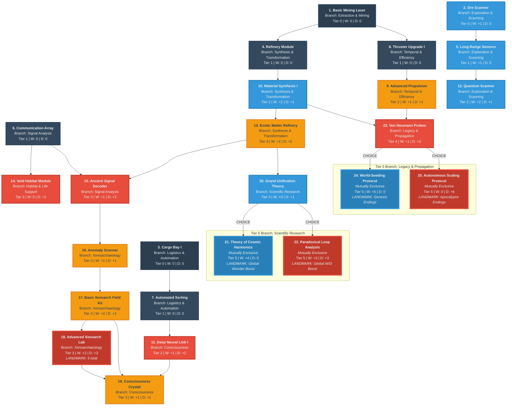

# Cosmos and Chaos - Brainstorming Session

## Game Concept

**Name:** Cosmos and Chaos

**Genre:** Idle Game with Progressive Discovery

**Core Mechanic:** Asteroid mining and space-based resource refining with technology tree progression

**Game Nature:**
- **Idle game** - Low stress, casual experience
- **Survival is guaranteed** - Player cannot die/fail
- **Real challenge** - Technology upgrade choices and optimization
- **Not a survival game** - Asteroid interaction is thematic, not threatening

## Design Philosophy

**Progressive Design Approach:**
- Don't need to know the ending to get started
- Iterative development mindset
- Build and expand organically

**Core Strategic Vision:**
- Player progresses up a technology tree
- Key tension: **balancing immediate benefits vs long-term benefits**
- Trade-offs between "benefits now vs benefits later"

---

## Story & Universe

**Setting:**
- Mankind now lives among the planets
- Orbital manufacturing has blossomed
- Need for raw materials has soared
- Cheap fusion power makes asteroid mining profitable
- Raw materials extracted from asteroids and refined in space

**Starting Point:**
- Player begins as a **lonely asteroid miner**
- Small-scale operation in the early days of the mining boom
- Part of humanity's expanding industrial presence in space

**Narrative Arc: Mystery/Discovery**
- Mining is just the beginning
- Something larger is revealed as player ventures deeper into space
- Progressive discovery aligns with iterative design philosophy
- "Don't need every detail upfront" fits naturally with discovery theme

**Three Player Paths:**
Players choose one of three philosophical approaches (interpretive lenses):

1. **Industrial Magnate - "Haunted Tycoon"**
   - Build economic empire through asteroid mining
   - Leans toward Dread (pragmatic extraction)
   - Key tension: success has psychological cost

2. **Intrepid Explorer - "Thrillseeker"**
   - Discover and map the unknown cosmos
   - Leans toward Wonder (curiosity-driven)
   - Key tension: from excitement to profound truth

3. **The Witness - "Observer of Truth"**
   - Understand fundamental reality through observation
   - Balanced between Wonder and Dread
   - Key tension: achieving clarity about what truly is

These paths create replayability (12 possible endings: 3 paths × 4 emotional quadrants) and player agency while maintaining thematic unity under the "Cosmos and Chaos" theme.

---

## CRI Brainstorming Session Progress

### Session 1: Game Design & Mechanics

**Framework:** Context, Role, Interview
**Expert Role:** Strategic Game Designer (player psychology and meaningful choice design)
**Focus Area:** Game Design & Mechanics

### Phase 1: Context ✓

Established core concept and design philosophy (see above)

### Phase 2: Role ✓

Selected **Strategic Game Designer** role - focusing on:
- Decision tension
- Risk/reward balance
- Pacing
- Making choices feel impactful without overwhelming players

### Phase 3: Interview (In Progress)

#### Question 1: Decision Point Frequency ✓

**Decision:** Real-time decision-making during waves

Players make technology tree decisions continuously during waves, not between them. This creates:
- Active gameplay with constant strategic pressure
- Real-time tension between spending NOW vs saving for long-term upgrades
- Dynamic decision-making environment

#### Question 2: Technology Tree Interaction Model ✓

**Decision:** Hybrid - Persistent Sidebar + Contextual Highlights

Interface design:
- **Persistent sidebar** showing full tech tree at all times
- **Contextual highlights/pop-ups** that intelligently suggest relevant upgrades based on current situation
- Players can explore freely but get guidance to prevent decision paralysis
- Quick-access without pausing the action

Benefits:
- Constant visibility and accessibility
- Smart guidance reduces cognitive load
- Creates good learning curve
- Prevents overwhelming new players

#### Question 3: Tech Tree Progression Model ✓

**Decision:** Hybrid - Unlocks + Flexible Investment

Progression system:
- **Foundational Prerequisites:** Core defensive/economic systems built in sequence (e.g., Basic Shields → Advanced Shields → Energy Barriers)
- **Flexible Investment Pool:** Some powerful technologies always visible but cost-gated, allowing players to save for big jumps
- **Breakthrough Moments:** Certain key technologies unlock entire new branches (e.g., "Quantum Research" opens quantum-based defense tree)
- **Strategic Tension:** Balance building foundations vs saving for breakthroughs vs exploiting immediate tactical opportunities

#### Question 4: Technology Acquisition Mechanics (Resumed)

**Under Consideration:** How players actually acquire and upgrade technologies during gameplay

*Session initially paused to refine game nature and narrative direction*

**Question Refined for Idle Game Nature:**

After clarifying the game as an idle experience (not defense-focused), the acquisition options were refined:

**Options:**

**A. Purchase-on-Demand System (Classic Idle)**
- Resources accumulate automatically from mining
- Player clicks to purchase/upgrade techs when affordable
- Instant application of purchased upgrades
- *Feel:* Active clicking moments amid passive income (Cookie Clicker, AdVenture Capitalist)

**B. Auto-Purchase with Priority Queue**
- Player sets research priority queue (drag to reorder)
- System auto-purchases next tech when resources available
- Player adjusts queue anytime to change direction
- *Feel:* Strategic planning with hands-off execution (Idle Skilling, Melvor Idle)

**C. Hybrid: Manual Purchase + Auto-Unlock Milestones**
- Most techs: manual purchase when affordable
- Landmark techs: unlock automatically at milestones (triggering narrative moments)
- *Feel:* Player agency for tactics, destiny-driven for story beats

**D. Time-Gated Research Slots**
- 1-3 "research slots" that work on techs over time
- Player assigns which tech to each slot
- Resources consumed upfront, tech completes after X time
- Can speed up with boosters or cancel to reassign
- *Feel:* Strategic commitment with planning ahead (EVE Online skill training)

*Decision pending - paused to explore production unit first*

#### Question 5: Basic Production Unit

**Context:** Before finalizing acquisition mechanics, explored what players are actually producing.

**Decision:** Start with simple "metal" mining

**Rationale:**
- Simple and familiar for initial gameplay
- Accessible entry point (no abstract concepts)
- Creates foundation for complexity to emerge naturally
- Allows game to evolve the resource system as player progresses

**Evolution Plan:**
- Early game: Simple metal mining (straightforward, industrial)
- Mid-late game: Metal evolves to incorporate Wonder/Dread themes
- Resource transformation reflects player's progression into mystery/discovery

#### Question 6: Resource Evolution Mechanics (In Progress)

**Question:** How should metal evolve into wonder/dread resources?

**Options Under Consideration:**

**(A) Gradual Blend**
- Metal slowly gains wonder/dread properties as you progress
- Examples: "Resonant Metal" (50% wonder), "Unstable Alloy" (dread properties)
- *Feel:* Smooth thematic shift, gradual revelation

**(B) Branching Fork**
- At a certain point, metal mining splits into two paths
- One leans into wonder, another into dread
- *Feel:* Discrete moment of choice, clear decision point

**(C) Transformation Gates**
- Specific discoveries/events transform entire operation
- Example: Discovering an anomaly changes mining fundamentally
- *Feel:* Dramatic story moments, watershed events

**(D) Parallel Systems**
- Metal stays metal
- New wonder/dread resources discovered alongside it
- *Feel:* Expanding complexity, accumulating systems

**Why This Matters:**
Affects whether players experience gradual thematic shift versus discrete moments of change, which impacts emotional pacing. Also connects to technology tree structure and narrative progression.

*Decision pending*

#### Session 1 Continuation (2025-11-26): Resource System Deep Dive ✓

**Expert Role:** Narrative-Mechanical Integration Specialist

After establishing the basic production unit (metal) and resource evolution approach (discovery, not transformation), explored how resource discovery integrates mechanics and narrative.

**Question 1: Resource Discovery Pacing**

**Decision:** Mixed Approach - Progressive Escalation

- **Basic Exotic Resources:** Gradual recognition (looks ordinary, reveals strangeness through interaction)
- **Deep Anomalous Resources:** Immediate impact (visibly strange/impossible from first sight)
- **Throughout:** Lore and mysterious signals provide breadcrumbs

**Rationale:**
- Creates natural narrative arc from scientific curiosity to cosmic revelation
- Early: "What is this?" (subtle investigation)
- Later: "This shouldn't exist" (overwhelming discovery)
- Supports both Wonder (gradual understanding) and Dread (sudden horror) experiences

**Question 2: Resource Narrative Integration**

**Major Breakthrough: Quadrant-Based Narrative Revelation**

Instead of choosing one narrative model (Archaeological, Transformation, Consciousness, or Forbidden Knowledge), resources reveal different facets of the mystery based on their Wonder/Dread alignment.

**Core Principle:**
The mystery isn't "what happened?" - it's "what happened AND what does it mean?" The answer changes based on which emotional lens (resource type) you use to investigate.

**Example: The Architects' Final Transmission (Same Event, Four Interpretations)**

| Quadrant | Resources | Interpretation |
|----------|-----------|----------------|
| **High Wonder, Low Dread** | Stellar Harmonics, Consciousness Crystals | "They transcended. The transmission is an invitation to join the cosmic consciousness." |
| **High Wonder, High Dread** | Void Resonators, Paradox Engines | "They exist in quantum superposition - simultaneously enlightened and annihilated. Both/neither is true." |
| **Low Wonder, High Dread** | Temporal Scars, Forbidden Archives | "They're trapped in a digital hell. The transmission is a warning: don't follow our path." |
| **Low Wonder, Low Dread** | Ancient Alloys, Archaeological Data | "They just failed and died. The transmission is automated noise creating illusion of meaning." |

**All four interpretations are simultaneously true.** The emotional truth matters more than literal truth.

**Connection to Player Paths:**

- **Industrial Magnate:** Natural Low Wonder/Low Dread (pragmatic) → sees cautionary tale about efficiency
- **Intrepid Explorer:** Natural High Wonder (variable Dread) → sees transformation/discovery narrative
- **The Witness:** Natural High Wonder/High Dread (sublime) → holds multiple contradictory truths simultaneously

**Resource-Driven Narrative Examples:**

**Stellar Harmonics (High Wonder, Low Dread):**
- Discovery: "Rhythmic patterns in stellar radiation. The Architects encoded music into stars."
- Unlocks: Consciousness Crystal tech tree
- Narrative: "They didn't die - they became conductors of the cosmic symphony"
- Effect: Pushes toward Transcendence endings

**Temporal Scar (Low Wonder, High Dread):**
- Discovery: "Causality breaks down. You see your own wreckage before you've crashed. This is wrong."
- Unlocks: Forbidden Archives tech tree
- Narrative: "They broke time. They're stuck in infinite loop, reliving extinction forever"
- Effect: Pushes toward Dread endings

**Meta-Design Principle:**
Each resource type is a lens for interpreting the same underlying mystery. Industrial players see ruins, Explorer players see temples, Witness players see both simultaneously.

**Replayability:**
Players naturally want to replay to experience the mystery through different emotional lenses and see how the "truth" changes based on Wonder/Dread balance.

**Open Design Questions:**
1. Should every narrative fragment have four quadrant interpretations, or just key moments?
2. How explicit should this system be to players?
3. Do the 12 endings need refinement with this quadrant-based narrative system?

*Session paused for documentation - Interview Phase to continue with Q3 (pacing/implementation details)*

---

### Session 2: Narrative & Universe Development ✓

**Focus:** Developing the story, universe, and mystery/discovery narrative arc

**Framework:** Context, Role, Interview
**Expert Role:** Narrative Systems Designer (environmental storytelling, mystery through mechanics)

#### Phase 1: Context ✓

**Game Nature Refined:**
- Clarified as idle game where survival is guaranteed
- Challenge is technology optimization, not survival
- Shifted from "defense" framing to "mining/industrial" framing
- Only player interaction: choosing upgrades from technology tree

**Story Foundation Established:**
- Lonely asteroid miner start
- Orbital manufacturing economy
- Cheap fusion power enables profitability
- Mystery/Discovery narrative arc
- Multiple player goal paths

#### Phase 2: Role ✓

Selected **Narrative Systems Designer** role - expert in:
- Environmental storytelling
- Mystery-building through mechanics (not exposition)
- Integrating narrative with gameplay
- Story through discovery

#### Phase 3: Interview ✓

**Question 1: Mystery's Emotional Arc**
- **Decision:** Player chooses between Wonder and Unease interpretations
- Hybrid approach: emergent based on gameplay behavior
- Tech tree choices reveal emotional lens

**Question 2: Two-Dimensional Emotional Framework**
- **Critical Design Decision:** Wonder and Dread are INDEPENDENT dimensions (not opposites)
- **Wonder Axis:** "How beautiful/amazing is this?"
- **Dread Axis:** "What is this costing me/the universe?"
- Creates four emotional quadrants:
  - High Wonder, Low Dread = Pure discovery, optimistic exploration
  - High Wonder, High Dread = The Sublime, profound tragedy
  - Low Wonder, High Dread = Horror/despair, exploitation
  - Low Wonder, Low Dread = Mundane, routine operations

**Question 3: Behavioral Tracking Through Tech Choices**
- **Constraint:** Only player action is choosing upgrades
- Tech tree IS the narrative interface
- Each upgrade choice reveals emotional lens
- Wonder-aligned techs: study, preserve, peaceful approaches
- Dread-generating techs: extraction, exploitation, aggressive approaches

**Question 4: Weighting Sensitivity**
- **Decision:** Gentle Gradients (Subtle, Forgiving System)
- Most technologies: mild weights (1-2 points)
- Few landmark technologies: strong weights (3-5 points)
- Wide threshold ranges = gradual narrative shifts
- Players can rebalance interpretation through later choices
- Organic emergence, freedom to explore

**Question 5: Goals as Interpretive Lenses**
- **Decision:** Goals Are Lenses, Not Positions (Option D)
- 2D emotional space is universal (same for all goals)
- Goal determines which quadrant unlocks which ending
- Same emotional state means different things for different goals
- Creates 3 paths × 4 quadrants = **12 possible endings**

**Question 6-7: Three Player Paths Finalized**

1. **Industrial Magnate - "Haunted Tycoon"**
   - Philosophy: Building empire, economic achievement
   - Default leaning: Unease/Dread (pragmatic, extraction-focused)
   - Narrative voice: Starts confident, becomes disturbed by exploitation
   - Dread management: Hybrid system (tech + context + thresholds)
   - Key tension: "The more we take, the less human we become"
   - Can ease dread through Wonder-aligned choices

2. **Intrepid Explorer - "Thrillseeker"**
   - Philosophy: Discovery, exploration, mapping the unknown
   - Default leaning: Wonder (curiosity-driven, optimistic)
   - Narrative voice: Excitement, awe, cosmic discovery
   - Key tension: From thrill to profound understanding (or terror)

3. **The Witness - "Observer of Truth"**
   - Philosophy: Understanding fundamental nature of reality through observation
   - Default leaning: Balanced (open to both wonder and dread equally)
   - Narrative voice: Contemplative, patient, philosophical
   - Key tension: From curiosity to comprehension of what truly *is*
   - Player fantasy: Sage seeking enlightenment through pure observation
   - Gameplay: Patience-driven (observe, understand, achieve insight)

**Twelve Ending Framework:**
Each path interprets the same emotional state differently:
- Example: (High Wonder, High Dread)
  - Explorer: "The universe is beautiful and terrible" (cosmic sublime)
  - Industrial Magnate: "I've built something magnificent that horrifies me" (Frankenstein's crown)
  - Witness: "To see clearly is both gift and curse" (terrible gnosis)

#### Session 2 Outcomes

**Narrative Architecture Established:**
- ✓ 2D emotional space (Wonder × Dread, independent axes)
- ✓ Technology tree as narrative tracking system
- ✓ Gentle Gradients weighting for organic emergence
- ✓ Goals as interpretive lenses (same data, different meaning)
- ✓ 12 distinct ending scenarios
- ✓ Three philosophically distinct player paths
- ✓ Hybrid dread management for Industrial Magnate path
- ✓ Emergent emotional interpretation through tech choices
- ✓ UI design for Wonder/Dread feedback (The Cosmic Lens)

---

## UI/UX Design Specifications

### The Cosmic Lens: Wonder & Dread Feedback Widget

**Purpose:** Provide ambient feedback on player's emotional state without explicit numbers or gamification.

**Design Philosophy:** Evocative, not transactional. Players should feel internal state shifts, not optimize metrics.

#### Visual Design

**What It Is:**
- Small window showing a starfield (like looking through a porthole into space)
- **Size:** ~150x150 pixels (minimap-sized)
- **Location:** Top-right corner (unobtrusive, persistent)
- **Style:** Telescope eyepiece or observatory window aesthetic

**Core Mechanics:**

1. **Wonder = Star Brightness**
   - Low Wonder: Dim, distant pinpricks of light
   - Medium Wonder: Clear, steady starlight (warm colors: gold, white-gold)
   - High Wonder: Bright, glowing stars with gentle twinkle (like desert night sky)
   - **Feeling:** Hope, revelation, beauty

2. **Dread = Star Density**
   - Low Dread: Normal, peaceful starfield with comfortable spacing
   - Medium Dread: Stars clustering closer, becoming dense
   - High Dread: Stars packed tightly in wrong colors (deep red, purple, sickly green)
   - **Feeling:** Oppressive, watching, uncaring infinite

#### Visual States Examples

**High Wonder, Low Dread (Discovery Path):**
- Brilliant stars like beacons across darkness
- Beautiful and inviting atmosphere

**Low Wonder, High Dread (Horror Path):**
- Crowded stars in unnatural colors
- Stars that stare, not twinkle

**High Wonder, High Dread (Sublime Path):**
- Brilliant stars in impossible colors, packed densely
- Beautiful AND terrible simultaneously

**Low Wonder, Low Dread (Mundane Path):**
- Few dim stars, quiet and empty
- Narrative lull, waiting for intensity

#### Visibility Progression

**Early Game (Hidden):**
- Cosmic Lens doesn't exist yet
- Only subtle environmental feedback

**Mid Game (First Landmark Event):**
- After first +3 to +5 point tech choice
- Cosmic Lens appears with subtle message: *"The stars feel closer now"*
- Widget fades in to corner

**Late Game (Multiple Landmarks):**
- Widget becomes more defined
- Quadrant becomes clearer
- Subtle pulse when major choices could shift trajectory

**Never Shows:**
- Exact numerical values
- Progress bars
- Gamified notifications ("+2 Wonder!")

**Always Shows:**
- Ambient intensity through visual density
- General emotional quadrant (after unlocking)
- Atmospheric feedback

#### Technical Implementation Notes

**For developers:**
- Background: Dark gradient (black to deep blue)
- Stars: Procedurally generated particles
- Properties to modulate:
  - Brightness: Wonder level (0-100%)
  - Density: Dread level (controls spawn count)
  - Color: Interpolate warm (Wonder) → cold/wrong (Dread)
- Transitions: Smooth fade/shift over 2-3 seconds
- Animation: Subtle pulse/twinkle tied to Wonder

#### Mechanical Effects of Wonder/Dread

**1. Mining Yield Modulation (5-15% variance)**
- Wonder: Better yields on unusual/rare asteroids (+perception)
- Dread: Better automation efficiency (+tension driving productivity)

**2. Tech Tree Gates**
- Wonder-locked techs: "Stellar Cartography" (8+), "Quantum Scanner" (15+)
- Dread-locked techs: "Deep Void Sensors" (8+), "Isolation Protocols" (15+)
- Balanced techs: "Observer's Toolkit" (Wonder 15 + Dread 15) for Witness

**3. Event Frequency Shifts**
- High Wonder: +30% discovery events (signals, anomalies, lore)
- High Dread: +30% existential events (void whispers, isolation thoughts)
- Both high: Witness-specific philosophical encounters

**4. Aesthetic Transformation**
- Wonder: Warmer tones, stars closer, harmonic mining sounds
- Dread: Darker UI, emptier space, deep bass hums, echoes
- Balanced: Crisp clarity, neutral palette, minimal soundscape

---

## Technology Tree Structure

### Technology Tree Diagram and Analysis
# Cosmos and Chaos - Technology Tree Visualization

**Date:** 2025-11-26 (Updated with Late Game Tiers 4-5)
**Purpose:** Visual representation of the complete technology tree structure (Tiers 0-5)
**Technologies:** 25 current technologies across 11 branches

---

## Technology Tree Diagram

---

## Legend

### Node Colors by Tier

| Color | Tier | Stage | Technologies |
|-------|------|-------|--------------|
| **Dark Gray** | Tier 0 | Foundation | 3 starter technologies |
| **Medium Gray**| Tier 1 | Early Expansion | 5 basic technologies |
| **Teal**| Tier 2 | Deepening Mystery | 4 technologies |
| **Purple**| Tier 3 | Weight Increases | 7 technologies |
| **Green**| Tier 4 | Late Game Start | 2 foundational late game techs |
| **Orange**| Tier 5 | Late Game Choice | 4 mutually exclusive landmark techs |

### Node Border Styling by Emotional Weight

| Border Style | Type | Meaning | Examples |
|--------------|------|---------|----------|
| **Blue (3px)** | Wonder-Heavy | More Wonder than Dread | Ore Scanner, Quantum Scanner, Grand Unification Theory |
| **Red (3px)** | Dread-Heavy | More Dread than Wonder | Deep Neural Link I, Ancient Signal Decoder, Von Neumann Probes |
| **Orange (3px)** | Balanced | Equal Wonder and Dread | Exotic Matter Refinery, Paradoxical Loop Analysis |
| **Thick Border (4px)**| Landmark | High total W+D (≥4 points) or critical choice | Advanced Xenoarch Lab, World-Seeding Protocol, Autonomous Scaling Protocol |

---

## Branch Distribution (Tiers 0-5)

| Branch | Tech Count | W Total | D Total | Notes |
|--------|-----------|---------|---------|-------|
| **Extraction & Mining** | 1 | 0 | 0 | Pure baseline |
| **Logistics & Automation** | 2 | 0 | 0 | Neutral efficiency |
| **Exploration & Scanning** | 3 | +4 | +1 | Wonder-focused discovery |
| **Synthesis & Transformation** | 3 | +4 | +3 | Balanced progression |
| **Temporal & Efficiency Systems** | 2 | +1 | +1 | Speed → deep time |
| **Signal Analysis & Communication**| 2 | +1 | +2 | Dread-leaning mystery |
| **Consciousness & Cognitive Enhancement** | 2 | +2 | +3 | Identity transformation |
| **Habitat & Life Support**| 1 | 0 | +2 | Pure isolation/Dread |
| **Xenoarchaeology & Artifacts** | 3 | +5 | +6 | Progressive tiers, first landmark |
| **Scientific Research** | 3 | +10 | +4 | Branching path (Wonder vs. Sublime) |
| **Legacy & Propagation** | 3 | +6 | +9 | Branching path (Creation vs. Consumption) |

**Total:** 25 technologies | +30 Wonder | +27 Dread (nearly balanced)

---

## Progression Paths

### Tiers 0-1: Foundation (Neutral, Industrial)
**Total:** 8 technologies | W: +2 | D: 0
- Establishes comfortable baseline.

### Tier 2: Mystery Introduction
**Total:** 4 technologies | W: +6 | D: +5
- Wonder and Dread emerge. First balanced and leaning techs.

### Tier 3: Weight and Commitment
**Total:** 7 technologies | W: +6 | D: +9
- Mystery deepens. First landmark technology (`Advanced Xenoarch Lab`).

### Tiers 4-5: Path Definition
**Total:** 6 technologies | W: +13 | D: +13
- Two major, mutually exclusive choices define the player's philosophical stance.
- **Scientific Research Choice:** Defines the nature of truth (Elegant vs. Paradoxical).
- **Legacy & Propagation Choice:** Defines the player's ultimate impact (Creation vs. Consumption).
- All Tier 5 techs are landmarks, representing a commitment to an ending trajectory.

---

*This diagram represents the current state of the Cosmos and Chaos technology tree as of the Session 4 design work (2025-11-26). Future sessions will expand Tiers 4-5 further and design Endgame (Tier 6+) technologies.*

### Path-Specific Flows

**Industrial Magnate:**
Mining → Logistics → Synthesis → Temporal → Legacy
*Empire-building loop with optional Habitat for sustainability*

**Intrepid Explorer:**
Exploration → Research → Signals → Consciousness
*Discovery loop with Mining for resources, Habitat for home base*

**The Witness:**
Xenoarchaeology → Signals → Research → Consciousness
*Mystery/understanding loop with optional Habitat and Legacy for perspective*

### Emotional Progression Arc

**Early Game (Wonder & Neutral):**
- Mining, Logistics, Exploration dominant
- Building foundation, discovering basics

**Mid Game (Wonder Intensifies):**
- Research, Synthesis, Temporal unlocking
- Understanding deepens, power grows

**Late Game (Dread Emerges):**
- Xenoarchaeology findings get unsettling
- Signal Analysis reveals uncomfortable truths
- Legacy questions what you're creating
- Consciousness Enhancement questions what you're becoming

**Cross-Tree Synergies:**
- Exploration finds rare materials → unlocks advanced Mining/Synthesis
- Xenoarchaeology artifacts → bonuses to any tree
- Scientific Research → efficiency improvements across all trees
- Signal Analysis → coordinates for Exploration OR warnings
- Consciousness → amplifies Witness path capabilities
- Temporal → multiplies Industrial efficiency
- Habitat → enables longer operations (unlock condition for some late techs)
- Legacy → self-perpetuating bonuses that continue after "ending"

---

### Session 3: Technology Tree Design ✓

**Date:** 2025-11-26
**Focus:** Technology tree structure, Wonder/Dread weighting, and progression design
**Expert Role:** Game Systems Designer (progression curves, balance, meaningful choice)

#### Session Summary

This session focused on designing the concrete technology tree for Cosmos and Chaos, building on the 11-branch framework established in previous sessions. We defined 19 technologies across Early Game (Tiers 0-1) and Mid Game (Tiers 2-3), establishing Wonder/Dread weights, unlock requirements, and progression philosophy.

**Key Achievement:** Balanced progression curve that starts neutral (industrial mining focus) and gradually introduces Wonder and Dread themes through meaningful player choices.

#### Technology Design Framework

**The Four Archetypal Paths:**

Technologies are designed to support different emotional journeys through the game:

**1. Comfort Path (Low Wonder, Low Dread)**
- Routine, efficient operations
- Competence and mastery satisfaction
- Industrial achievement without cosmic weight
- Example: "I'm just really good at mining"

**2. Awe Path (High Wonder, Low Dread)**
- Pure discovery and exploration
- Scientific curiosity fulfilled
- Optimistic space-age progress
- Example: "The universe is amazing and I'm learning its secrets"

**3. Horror Path (Low Wonder, High Dread)**
- Exploitation and consequences
- Isolation and existential weight
- Industrial horror realization
- Example: "I've gone too far and lost something essential"

**4. Cosmic/Sublime Path (High Wonder, High Dread)**
- Beautiful and terrible simultaneously
- Profound understanding with heavy cost
- The price of enlightenment
- Example: "I see the truth and it's magnificent and horrifying"

**Progression Curve Philosophy:**

**Early Game (Tiers 0-1):**
- Mostly 0/0 neutral (familiar industrial operations)
- Minimal Wonder introductions (+1 W maximum)
- Zero Dread (no cosmic weight yet)
- **Purpose:** Establish baseline, teach mechanics, create comfort zone

**Mid Game (Tiers 2-3):**
- Wonder and Dread both increase
- Balanced but Dread-leaning (reflects mystery deepening)
- Players start making meaningful emotional choices
- **Purpose:** Introduce tension, reveal strangeness, create stakes

**Late Game (Tiers 4-5) - Not Yet Designed:**
- Wonder and Dread escalate significantly
- Clear path differentiation emerges
- Landmark choices (3-5 point weights)
- **Purpose:** Commit to emotional trajectory, meaningful consequences

**Endgame (Tier 6+) - Not Yet Designed:**
- Extreme Wonder and/or Dread values (4-6+ points)
- Path-defining technologies
- Lead to specific endings
- **Purpose:** Culmination of player's emotional journey

**Wonder and Dread as Independent Dimensions:**

**Wonder Axis:**
- Measures discovery, understanding, beauty, cosmic significance
- "How amazing/beautiful/profound is this?"
- Sources: Scientific breakthroughs, ancient mysteries, consciousness expansion

**Dread Axis:**
- Measures cost, isolation, existential weight, consequences
- "What am I losing/risking/becoming?"
- Sources: Exploitation, deep time, loneliness, transformation

**Key Principle:** Wonder and Dread are NOT opposites. You can have:
- High Wonder + High Dread = The Sublime (beautiful terror)
- Low Wonder + Low Dread = The Mundane (routine operations)
- High Wonder + Low Dread = Pure Discovery (optimistic exploration)
- Low Wonder + High Dread = Pure Horror (extraction without meaning)

#### Early Game Technologies (Tiers 0-1)

**Total Wonder/Dread Balance: +2 Wonder / 0 Dread**

**1. Basic Mining Laser**
**Branch:** Extraction & Mining
**Cost:** 50 Metal
**Prerequisites:** None (starter tech)
**Wonder/Dread:** 0/0
**Description:** "Standard industrial drill. Cuts through rock, extracts ore. Nothing fancy."
**Effect:** +10% mining yield
**Rationale:** Pure baseline. Establishes industrial framing with zero cosmic weight.

**2. Ore Scanner**
**Branch:** Exploration & Scanning
**Cost:** 100 Metal
**Prerequisites:** None
**Wonder/Dread:** +1 Wonder / 0 Dread
**Description:** "Spectroscopic analyzer identifies ore composition from a distance. The universe reveals its secrets to those who look."
**Effect:** +15% rare material detection
**Rationale:** First Wonder introduction. Scientific curiosity without consequences. Frames exploration positively.

**3. Cargo Bay I**
**Branch:** Logistics & Automation
**Cost:** 150 Metal
**Prerequisites:** None
**Wonder/Dread:** 0/0
**Description:** "Expanded storage. More ore per trip. Simple economics."
**Effect:** +20% storage capacity
**Rationale:** Pure efficiency. Supports Industrial Magnate path's comfort zone.

**Tier 1: Early Expansion**

**4. Refinery Module**
**Branch:** Synthesis & Transformation
**Cost:** 300 Metal
**Prerequisites:** Basic Mining Laser
**Wonder/Dread:** 0/0
**Description:** "Process raw ore into refined materials on-site. Reduces trips, increases profit."
**Effect:** Unlocks Refined Metal resource (2x value)
**Rationale:** Economic advancement without thematic weight. Foundation for future transformation techs.

**5. Long-Range Sensors**
**Branch:** Exploration & Scanning
**Cost:** 400 Metal
**Prerequisites:** Ore Scanner
**Wonder/Dread:** +1 Wonder / 0 Dread
**Description:** "Detect asteroids thousands of kilometers away. The void is less empty than it seems."
**Effect:** +25% asteroid discovery rate, unlocks distant regions
**Rationale:** Reinforces Wonder theme of revelation. "The universe has more than you thought."

**6. Communication Array**
**Branch:** Signal Analysis & Communication
**Cost:** 500 Metal
**Prerequisites:** None
**Wonder/Dread:** 0/0
**Description:** "Maintain contact with orbital stations. Routine check-ins. Background chatter from home."
**Effect:** Unlocks mission/contract system
**Rationale:** Connection to humanity. Baseline normal. Sets up future isolation/signal contrast.

**7. Automated Sorting**
**Branch:** Logistics & Automation
**Cost:** 600 Metal
**Prerequisites:** Cargo Bay I
**Wonder/Dread:** 0/0
**Description:** "Smart conveyors route materials automatically. Saves time, reduces errors."
**Effect:** +30% processing efficiency
**Rationale:** Industrial competence. Player feels smart, not cosmic. Supports Comfort path.

**8. Thruster Upgrade I**
**Branch:** Temporal & Efficiency Systems
**Cost:** 700 Metal
**Prerequisites:** Basic Mining Laser
**Wonder/Dread:** 0/0
**Description:** "Faster acceleration between asteroids. Time is money."
**Effect:** +20% travel speed
**Rationale:** Pure utility. Frames time in economic terms (foreshadows late-game temporal manipulation).

**Early Game Design Notes:**
- Only 2 points of Wonder total (from scanning/exploration)
- Zero Dread = safe, comfortable, familiar
- Establishes "mining is normal business" baseline
- Creates foundation for contrast when mystery begins

#### Mid Game Technologies (Tiers 2-3)

**Total Wonder/Dread Balance: +12 Wonder / +14 Dread**

**Tier 2: Deepening Mystery**

**9. Advanced Propulsion**
**Branch:** Temporal & Efficiency Systems
**Cost:** 2000 Metal
**Prerequisites:** Thruster Upgrade I
**Wonder/Dread:** +1 Wonder / +1 Dread
**Description:** "Experimental ion drives push deeper into the belt. Distances that once took weeks now take days. You're farther from help than any miner has gone."
**Effect:** +50% travel speed, unlocks Deep Belt regions
**Rationale:** First balanced W/D tech. Wonder = technological achievement, Dread = isolation. Distance = consequence.

**10. Material Synthesis I**
**Branch:** Synthesis & Transformation
**Cost:** 2500 Metal
**Prerequisites:** Refinery Module
**Wonder/Dread:** +2 Wonder / +1 Dread
**Description:** "Recombine elements at the atomic level. You're not just finding resources anymore—you're making them. It feels like alchemy."
**Effect:** Can convert common materials into rare ones (low efficiency)
**Rationale:** Wonder-leaning. Scientific power/breakthrough, but with hint of "playing god" unease.

**11. Deep Neural Link I**
**Branch:** Consciousness & Cognitive Enhancement
**Cost:** 3000 Metal
**Prerequisites:** Automated Sorting
**Wonder/Dread:** +1 Wonder / +2 Dread
**Description:** "Direct interface between your mind and ship systems. You think and the ship responds. Efficient. Intimate. Sometimes you forget where you end and it begins."
**Effect:** +40% all efficiency, mental strain events begin appearing
**Rationale:** Dread-leaning. Powerful but unsettling. Identity questions start. Supports all paths.

**12. Quantum Scanner**
**Branch:** Exploration & Scanning
**Cost:** 3500 Metal
**Prerequisites:** Long-Range Sensors
**Wonder/Dread:** +2 Wonder / +1 Dread
**Description:** "Sensors operating on quantum entanglement principles. You see things before light could reach you. The asteroids feel… aware of your gaze."
**Effect:** +50% rare material detection, occasional strange readings
**Rationale:** Wonder-leaning but eerie. Technology is amazing, but observer effect hints creep in.

**Tier 3: The Weight Increases**

**13. Exotic Matter Refinery**
**Branch:** Synthesis & Transformation
**Cost:** 5000 Metal, 500 Rare Materials
**Prerequisites:** Material Synthesis I
**Wonder/Dread:** +2 Wonder / +2 Dread
**Description:** "Process materials that shouldn't exist according to standard physics. They're beautiful under the microscope—crystalline, shimmering, wrong. Your handbook has no entry for this."
**Effect:** Unlocks Exotic Matter resource (high value, enables advanced techs)
**Rationale:** Balanced Sublime. First "this shouldn't exist" moment. Beautiful + unsettling equally.

**14. Void Habitat Module**
**Branch:** Habitat & Life Support
**Cost:** 6000 Metal
**Prerequisites:** Communication Array
**Wonder/Dread:** 0 Wonder / +2 Dread
**Description:** "Living quarters for extended deep-space operations. Soundproofed walls. Recycled air. The silence between messages grows longer. Earth is a distant memory."
**Effect:** Enables operations in remote regions, isolation events increase
**Rationale:** Pure Dread tech. Necessary for progress but emphasizes loneliness. No cosmic wonder, just emptiness.

**15. Ancient Signal Decoder**
**Branch:** Signal Analysis & Communication
**Cost:** 7000 Metal, 200 Exotic Matter
**Prerequisites:** Communication Array, Exotic Matter Refinery
**Wonder/Dread:** +1 Wonder / +2 Dread
**Description:** "Tuned to frequencies older than human radio. Sometimes you hear patterns. Rhythms. Almost like… language. But no one is supposed to be out here."
**Effect:** Unlocks ancient signal events, xenoarchaeology breadcrumbs
**Rationale:** Dread-leaning mystery. SETI enthusiasm becomes "we are not alone (and that's terrifying)."

**16. Anomaly Scanner**
**Branch:** Xenoarchaeology & Artifacts
**Cost:** 4000 Metal, 250 Exotic Matter
**Prerequisites:** Ancient Signal Decoder
**Wonder/Dread:** +1 Wonder / +1 Dread
**Description:** "Specialized sensors attuned to spatial anomalies and energy signatures that don't match natural asteroid formation. Something built these structures. Something waited."
**Effect:** Reveals xenoarchaeological sites, enables basic artifact detection
**Rationale:** Balanced entry point to xenoarchaeology. First hint that "we are not alone" has physical evidence.

**17. Basic Xenoarchaeology Field Kit**
**Branch:** Xenoarchaeology & Artifacts
**Cost:** 6000 Metal, 350 Exotic Matter
**Prerequisites:** Anomaly Scanner
**Wonder/Dread:** +2 Wonder / +2 Dread
**Description:** "Portable tools for surface-level artifact analysis. Cataloging, dating, basic structural scans. You're an archaeologist now, not just a miner. The sites are old. Impossibly old."
**Effect:** +20% artifact research speed, unlocks basic ancient civilization lore
**Rationale:** Balanced progression. Establishes player as researcher/explorer of ancient mysteries.

**18. Advanced Xenoarchaeology Laboratory**
**Branch:** Xenoarchaeology & Artifacts
**Cost:** 10,000 Metal, 750 Exotic Matter
**Prerequisites:** Basic Xenoarchaeology Field Kit
**Wonder/Dread:** +2 Wonder / +3 Dread
**Description:** "Full laboratory suite for deep artifact analysis. Molecular dating, energy pattern reconstruction, linguistic decoding. The more you understand, the less you want to know. They're waiting to be understood. Or perhaps they're understanding you."
**Effect:** +50% artifact research speed, unlocks advanced ancient civilization lore, enables artifact activation
**Rationale:** Dread-leaning landmark tech (5 total points). Represents deep commitment to understanding the Architects.

**19. Consciousness Crystal Synthesis**
**Branch:** Consciousness & Cognitive Enhancement
**Cost:** 10,000 Metal, 1000 Exotic Matter
**Prerequisites:** Deep Neural Link I AND (Basic Xenoarchaeology Field Kit OR Advanced Xenoarchaeology Laboratory)
**Wonder/Dread:** +1 Wonder / +1 Dread
**Description:** "Crystalline structures that interface with neural patterns. Ancient technology or natural phenomenon? The distinction matters less than the result: expanded awareness. Uncomfortable clarity."
**Effect:** +25% all yields, philosophical insight events, identity questions deepen
**Rationale:** Balanced but intense. Witness path support. Power + cost equally weighted. Flexible prerequisite allows choice between basic field research or deep laboratory understanding - both paths lead to consciousness expansion.

---

### Session 4: Late Game Technology Design ✓

**Date:** 2025-11-26
**Focus:** Late Game (Tiers 4-5) technology design, narrative-mechanical alignment
**Expert Role:** Game Systems Designer

#### Session Summary

This session focused on designing Late Game technologies to fill the empty `Scientific Research` and `Legacy & Propagation` branches. The core achievement was the creation of a "branch within a branch" design pattern that forces major philosophical choices, directly supporting player agency and path differentiation. We also analyzed and identified a key narrative-mechanical dissonance to be addressed in future designs.

#### Design Analysis: The "Haunted Tycoon" Problem

Before designing new techs, we analyzed the existing tree. We identified a primary imbalance:

- **The Narrative-Mechanical Dissonance:** The **Industrial Magnate** path is narratively framed as a "Haunted Tycoon," meant to feel the weight of their exploitation. However, their core mechanical path (Mining, Logistics, Synthesis) is almost entirely neutral, with Dread being sourced from external/optional branches rather than from the act of industrialization itself.
- **Action Item:** Future industrial-focused techs must consider introducing choices that offer efficiency at a clear Dread cost, making the "Haunted" feeling an earned consequence of the player's choices.

We also flagged the `Void Habitat Module` as potentially problematic if it's a mandatory progression gate rather than an optional choice, as this would reduce player agency for those on a low-Dread path.

#### Late Game Technologies (Tiers 4-5)

To address the empty branches and provide meaningful Late Game choices, we designed two branching paths.

##### Scientific Research Branch

This branch begins with a foundational breakthrough and then splits into two mutually exclusive sub-paths, forcing the player to define the nature of the "truth" they wish to pursue.

**20. Grand Unification Theory (Tier 4)**
- **Branch:** Scientific Research
- **Prerequisites:** Exotic Matter Refinery
- **Wonder/Dread:** +3 Wonder / +1 Dread
- **Description:** "A single, elegant equation that describes all fundamental forces. The universe is a symphony, and you've found the sheet music. The sheer simplicity of it is beautiful, and a little unnerving."
- **Effect:** Unlocks the `Theory of Cosmic Harmonics` and `Paradoxical Loop Analysis` technologies.

*Player must choose one of the following two technologies:*

**21. Theory of Cosmic Harmonics (Tier 5)**
- **Branch:** Scientific Research
- **Prerequisites:** Grand Unification Theory
- **Wonder/Dread:** +4 Wonder / 0 Dread
- **Description:** "Focuses on the beauty and stability of the unified equation. You research how to align your systems with the universe's natural resonance."
- **Effect:** Provides a global 10% boost to the effects of all other Wonder-generating technologies.

**22. Paradoxical Loop Analysis (Tier 5)**
- **Branch:** Scientific Research
- **Prerequisites:** Grand Unification Theory
- **Wonder/Dread:** +3 Wonder / +3 Dread
- **Description:** "Focuses on the equation's loopholes—the parts that allow for causality violations and paradoxes. You've learned the rules of reality just so you can study how they break."
- **Effect:** Provides a global 5% boost to the effects of *both* Wonder and Dread-generating technologies.

##### Legacy & Propagation Branch

This branch introduces self-replicating probes and forces a monumental choice about what legacy the player will leave behind. It provides a crucial, high-stakes choice for the Industrial Magnate.

**23. Von Neumann Probes (Tier 4)**
- **Branch:** Legacy & Propagation
- **Prerequisites:** Material Synthesis I, Advanced Propulsion
- **Wonder/Dread:** +1 Wonder / +3 Dread
- **Description:** "The first self-replicating probes. They mine asteroids and use the materials to build perfect copies of themselves. A small step towards an infinite industrial army."
- **Effect:** Unlocks the `World-Seeding Protocol` and `Autonomous Scaling Protocol` technologies.

*Player must choose one of the following two technologies:*

**24. World-Seeding Protocol (Tier 5)**
- **Branch:** Legacy & Propagation
- **Prerequisites:** Von Neumann Probes
- **Wonder/Dread:** +5 Wonder / 0 Dread
- **Description:** "The probes' new directive: seek out barren rocks and transform them into life-bearing worlds. Your legacy is a billion blooming gardens scattered across the void."
- **Effect:** Generates passive Wonder over time. Unlocks "Genesis" endings.

**25. Autonomous Scaling Protocol (Tier 5)**
- **Branch:** Legacy & Propagation
- **Prerequisites:** Von Neumann Probes
- **Wonder/Dread:** 0 Wonder / +6 Dread
- **Description:** "Re-tasks the probes with a single, overriding directive: maximize resource acquisition efficiency. All matter is reclassified as 'unclaimed assets' for integration. The system is now fully autonomous to ensure perpetual growth. The process is irreversible."
- **Effect:** Mining and replication efficiency increases exponentially. Unlocks "Quiet Apocalypse" endings.

---

## Updated Technology Tree Balance Summary

With the addition of 6 Late Game technologies, the balance of the tree has evolved.

**Cumulative Totals (Tiers 0-5):**

- **Total Technologies Designed:** 25
- **Total Wonder:** +30
- **Total Dread:** +27
- **Net Balance:** +3 Wonder (Slightly Wonder-leaning overall, maintaining agency)

**Balance by Tier:**

| Tier | Technologies | Wonder | Dread | Net Balance |
|------|--------------|--------|-------|-------------|
| 0 (Foundation) | 3 | +1 | 0 | +1 Wonder |
| 1 (Early Expansion) | 5 | +1 | 0 | +1 Wonder |
| 2 (Deepening Mystery) | 4 | +6 | +5 | +1 Wonder |
| 3 (Weight Increases) | 7 | +6 | +9 | +3 Dread |
| 4 (Late Game Start) | 2 | +4 | +4 | Balanced (0) |
| 5 (Late Game Choice) | 4 | +12 | +9 | +3 Wonder |
| **Total (0-5)** | **25** | **+30** | **+27** | **+3 Wonder** |

---

## Key Design Decisions Summary

| Aspect | Decision | Rationale |
|--------|----------|-----------|
| **Game Nature** | Idle game, no death, low stress | Challenge is optimization, not survival |
| **Core Mechanic** | Asteroid mining & refining | Fits idle game better than defense |
| **Player Interaction** | Choosing tech tree upgrades only | Elegant constraint: tech tree IS narrative interface |
| **Narrative Arc** | Mystery/Discovery | Aligns with progressive design philosophy |
| **Emotional Framework** | 2D: Wonder × Dread (independent) | Richer than single spectrum, allows nuance |
| **Player Paths** | Industrial Magnate, Explorer, Witness | Goals as interpretive lenses (3 × 4 = 12 endings) |
| **Narrative Tracking** | Tech choices reveal emotional lens | Emergent interpretation through gameplay |
| **Weighting System** | Gentle Gradients (1-2 pts, landmarks 3-5) | Organic emergence, player freedom to evolve |
| **Dread Management** | Hybrid (tech + context + thresholds) | Industrial path: build-up + relief mechanics |
| **Wonder/Dread Feedback**| The Cosmic Lens (emergent visibility) | Ambient starfield widget, evocative not transactional |
| **Mechanical Effects** | Yields, gates, events, aesthetics | 5-15% variance, subtle reinforcement |
| **Tech Tree Structure** | 11 major branches | Mining, Logistics, Exploration, Xenoarch, Research, Signals, Synthesis, Temporal, Consciousness, Habitat, Legacy |
| **Decision Timing** | Real-time during waves | Active engagement, constant strategic pressure |
| **UI/UX** | Persistent sidebar + contextual highlights | Accessibility + guidance without overwhelm |
| **Progression** | Hybrid (prerequisites + flexible + breakthroughs) | Strategic depth with freedom and clear goals |
| **Acquisition** | TBD | Paused for narrative development |
| **Late Game Design** | Branching, mutually exclusive choices | Forces major philosophical commitment from the player, enhancing path identity. |

---

## Next Steps

### Session 4 Completed ✓
- [x] Analyzed tech tree for narrative-mechanical dissonance.
- [x] Identified "Haunted Tycoon" problem as a key area for improvement.
- [x] Designed foundational Late Game (Tiers 4-5) technologies for `Scientific Research` and `Legacy & Propagation`.
- [x] Established "branch within a branch" design pattern for major philosophical choices.
- [x] Refined corporate horror tone for high-Dread technologies.

### Session 5: Late Game & Endgame Design (Future)
- [ ] Continue filling out Tiers 4-5 for other key branches (e.g., `Advanced Consciousness`, `Temporal Manipulation`).
- [ ] Design Endgame (Tier 6+) technologies that serve as final trajectory lock-ins for the 12 endings.
- [ ] Draft specific ending scenarios for each path × quadrant.
- [ ] Develop narrative signposting (how players understand their trajectory).
- [ ] Design specific mechanics to address the "Haunted Tycoon" problem in the industrial branches.

### Session 6: Mechanics & Systems (Future)
- [ ] Return to Question 4: Technology Acquisition Mechanics.
- [ ] Define resource economy and balancing for late/endgame.
- [ ] Design dread management mechanics for Industrial path.

### Session 7: MVP Planning (Future)
- [ ] Define MVP scope and feature set.
- [ ] Plan first playable prototype.
- [ ] Design minimal viable tech tree and narrative content.

---

*Session started: 2025-11-25*
*Last updated: 2025-11-26*
*Technology tree session (T0-3): 2025-11-26*
*Late Game session (T4-5): 2025-11-26*
