# Cosmos and Chaos - Technology Tree Visualization

**Date:** 2025-11-26 (Updated with Xenoarchaeology redesign)
**Purpose:** Visual representation of the complete technology tree structure (Tiers 0-3)
**Technologies:** 19 current technologies across 11 branches

---

## Technology Tree Diagram

```mermaid
graph TB
    %% Styling
    classDef tier0 fill:#2c3e50,stroke:#34495e,stroke-width:2px,color:#ecf0f1
    classDef tier1 fill:#34495e,stroke:#2c3e50,stroke-width:2px,color:#ecf0f1
    classDef tier2 fill:#16a085,stroke:#1abc9c,stroke-width:2px,color:#ecf0f1
    classDef tier3 fill:#8e44ad,stroke:#9b59b6,stroke-width:2px,color:#ecf0f1
    classDef wonderHeavy fill:#3498db,stroke:#2980b9,stroke-width:3px,color:#ecf0f1
    classDef dreadHeavy fill:#e74c3c,stroke:#c0392b,stroke-width:3px,color:#ecf0f1
    classDef balanced fill:#f39c12,stroke:#e67e22,stroke-width:3px,color:#2c3e50
    classDef landmark fill:#c0392b,stroke:#e74c3c,stroke-width:4px,color:#ecf0f1

    %% Tier 0: Foundation
    T01["<b>1. Basic Mining Laser</b><br/>Branch: Extraction & Mining<br/>Tier 0 | W: 0 | D: 0<br/>Cost: 50 Metal<br/>+10% mining yield"]
    T02["<b>2. Ore Scanner</b><br/>Branch: Exploration & Scanning<br/>Tier 0 | W: +1 | D: 0<br/>Cost: 100 Metal<br/>+15% rare material detection"]
    T03["<b>3. Cargo Bay I</b><br/>Branch: Logistics & Automation<br/>Tier 0 | W: 0 | D: 0<br/>Cost: 150 Metal<br/>+20% storage capacity"]

    %% Tier 1: Early Expansion
    T04["<b>4. Refinery Module</b><br/>Branch: Synthesis & Transformation<br/>Tier 1 | W: 0 | D: 0<br/>Cost: 300 Metal<br/>Unlocks Refined Metal"]
    T05["<b>5. Long-Range Sensors</b><br/>Branch: Exploration & Scanning<br/>Tier 1 | W: +1 | D: 0<br/>Cost: 400 Metal<br/>+25% asteroid discovery<br/>Unlocks distant regions"]
    T06["<b>6. Communication Array</b><br/>Branch: Signal Analysis<br/>Tier 1 | W: 0 | D: 0<br/>Cost: 500 Metal<br/>Unlocks mission system"]
    T07["<b>7. Automated Sorting</b><br/>Branch: Logistics & Automation<br/>Tier 1 | W: 0 | D: 0<br/>Cost: 600 Metal<br/>+30% processing efficiency"]
    T08["<b>8. Thruster Upgrade I</b><br/>Branch: Temporal & Efficiency<br/>Tier 1 | W: 0 | D: 0<br/>Cost: 700 Metal<br/>+20% travel speed"]

    %% Tier 2: Deepening Mystery
    T09["<b>9. Advanced Propulsion</b><br/>Branch: Temporal & Efficiency<br/>Tier 2 | W: +1 | D: +1<br/>Cost: 2000 Metal<br/>+50% travel speed<br/>Unlocks Deep Belt<br/><i>First balanced W/D</i>"]
    T10["<b>10. Material Synthesis I</b><br/>Branch: Synthesis & Transformation<br/>Tier 2 | W: +2 | D: +1<br/>Cost: 2500 Metal<br/>Convert materials<br/><i>Wonder-leaning</i>"]
    T11["<b>11. Deep Neural Link I</b><br/>Branch: Consciousness<br/>Tier 2 | W: +1 | D: +2<br/>Cost: 3000 Metal<br/>+40% all efficiency<br/><i>Dread-leaning</i>"]
    T12["<b>12. Quantum Scanner</b><br/>Branch: Exploration & Scanning<br/>Tier 2 | W: +2 | D: +1<br/>Cost: 3500 Metal<br/>+50% rare detection<br/><i>Wonder-leaning</i>"]

    %% Tier 3: The Weight Increases
    T13["<b>13. Exotic Matter Refinery</b><br/>Branch: Synthesis & Transformation<br/>Tier 3 | W: +2 | D: +2<br/>Cost: 5000 Metal, 500 Rare<br/>Unlocks Exotic Matter<br/><i>Balanced Sublime</i>"]
    T14["<b>14. Void Habitat Module</b><br/>Branch: Habitat & Life Support<br/>Tier 3 | W: 0 | D: +2<br/>Cost: 6000 Metal<br/>Enables remote ops<br/><i>Pure Dread</i>"]
    T15["<b>15. Ancient Signal Decoder</b><br/>Branch: Signal Analysis<br/>Tier 3 | W: +1 | D: +2<br/>Cost: 7000 Metal, 200 Exotic<br/>Unlocks ancient signals<br/><i>Dread-leaning mystery</i>"]
    T16["<b>16. Anomaly Scanner</b><br/>Branch: Xenoarchaeology<br/>Tier 3 | W: +1 | D: +1<br/>Cost: 4000 Metal, 250 Exotic<br/>Reveals xenoarch sites<br/><i>Balanced entry</i>"]
    T17["<b>17. Basic Xenoarch Field Kit</b><br/>Branch: Xenoarchaeology<br/>Tier 3 | W: +2 | D: +2<br/>Cost: 6000 Metal, 350 Exotic<br/>+20% artifact research<br/><i>Balanced progression</i>"]
    T18["<b>18. Advanced Xenoarch Lab</b><br/>Branch: Xenoarchaeology<br/>Tier 3 | W: +2 | D: +3<br/>Cost: 10k Metal, 750 Exotic<br/>+50% artifact research<br/><i>LANDMARK: 5 points total</i>"]
    T19["<b>19. Consciousness Crystal</b><br/>Branch: Consciousness<br/>Tier 3 | W: +1 | D: +1<br/>Cost: 10k Metal, 1k Exotic<br/>+25% all yields<br/><i>Balanced transformation</i>"]

    %% Prerequisites (Dependencies)
    T01 --> T04
    T01 --> T08
    T02 --> T05
    T03 --> T07
    T04 --> T10
    T05 --> T12
    T07 --> T11
    T08 --> T09
    T10 --> T13
    T06 --> T14
    T06 --> T15
    T13 --> T15
    T15 --> T16
    T16 --> T17
    T17 --> T18
    T11 --> T19
    T17 --> T19
    T18 --> T19

    %% Apply tier styling
    class T01,T02,T03 tier0
    class T04,T05,T06,T07,T08 tier1
    class T09,T10,T11,T12 tier2
    class T13,T14,T15,T16,T17,T18,T19 tier3

    %% Apply emotional weight styling
    class T02,T05,T10,T12 wonderHeavy
    class T11,T14,T15 dreadHeavy
    class T09,T13,T16,T17,T19 balanced
    class T18 landmark
```



---

## Legend

### Node Colors by Tier

| Color | Tier | Stage | Technologies |
|-------|------|-------|--------------|
| **Dark Gray** | Tier 0 | Foundation | 3 starter technologies |
| **Medium Gray** | Tier 1 | Early Expansion | 5 basic technologies |
| **Teal** | Tier 2 | Deepening Mystery | 4 technologies |
| **Purple** | Tier 3 | Weight Increases | 7 technologies |

### Node Border Styling by Emotional Weight

| Border Style | Type | Meaning | Examples |
|--------------|------|---------|----------|
| **Blue (3px)** | Wonder-Heavy | More Wonder than Dread | Ore Scanner, Long-Range Sensors, Material Synthesis I, Quantum Scanner |
| **Red (3px)** | Dread-Heavy | More Dread than Wonder | Deep Neural Link I, Void Habitat Module, Ancient Signal Decoder |
| **Orange (3px)** | Balanced | Equal Wonder and Dread | Advanced Propulsion, Exotic Matter Refinery, Anomaly Scanner, Basic Xenoarch Field Kit, Consciousness Crystal |
| **Dark Red (4px)** | Landmark | High total W+D (≥5 points) | **Advanced Xenoarchaeology Laboratory** (W:+2, D:+3) |

### Information in Each Node

Each technology node displays:
- **Number and Name** (e.g., "1. Basic Mining Laser")
- **Branch** (which of 11 tech tree branches)
- **Tier** (progression level 0-3)
- **Wonder/Dread Values** (W: +X | D: +X)
- **Cost** (resources required)
- **Primary Effect** (mechanical benefit)
- **Design Notes** (emotional intent in italics)

### Arrows (Prerequisites)

Arrows show **prerequisite dependencies**:
- Arrow FROM Technology A TO Technology B means: "A must be unlocked before B"
- Example: Basic Mining Laser → Refinery Module (must have mining before refining)

---

## Branch Distribution

Technologies organized by the 11 major branches:

| Branch | Tech Count | W Total | D Total | Notes |
|--------|-----------|---------|---------|-------|
| **Extraction & Mining** | 1 | 0 | 0 | Pure baseline |
| **Logistics & Automation** | 2 | 0 | 0 | Neutral efficiency |
| **Exploration & Scanning** | 3 | +4 | +1 | Wonder-focused discovery |
| **Synthesis & Transformation** | 3 | +4 | +3 | Balanced progression |
| **Temporal & Efficiency Systems** | 2 | +1 | +1 | Speed → deep time |
| **Signal Analysis & Communication** | 2 | +1 | +2 | Dread-leaning mystery |
| **Consciousness & Cognitive Enhancement** | 2 | +2 | +3 | Identity transformation |
| **Habitat & Life Support** | 1 | 0 | +2 | Pure isolation/Dread |
| **Xenoarchaeology & Artifacts** | 3 | +5 | +6 | Progressive tiers, landmark Laboratory (5 pts) |
| **Scientific Research** | 0 | — | — | *Not yet designed* |
| **Legacy & Propagation** | 0 | — | — | *Not yet designed* |

**Total:** 19 technologies | +14 Wonder | +14 Dread (perfectly balanced)

---

## Progression Paths

### Tier 0-1: Foundation (Neutral, Industrial)
**Total:** 8 technologies | W: +2 | D: 0

All players start here. Familiar mining operations with minimal cosmic weight. Only Wonder sources are scanning technologies (scientific curiosity). Zero Dread establishes comfortable baseline.

**Key Technologies:**
- Basic Mining Laser (pure baseline)
- Ore Scanner (first +1 Wonder)
- Communication Array (connection to humanity)

### Tier 2: Mystery Introduction
**Total:** 4 technologies | W: +6 | D: +5

Wonder and Dread both emerge. First balanced technology (Advanced Propulsion: +1/+1). Players begin making meaningful emotional choices. Technology starts feeling strange.

**Key Technologies:**
- Advanced Propulsion (first balanced W/D, isolation theme)
- Deep Neural Link I (first Dread-heavy, identity questions)
- Quantum Scanner (Wonder-heavy, observer effect)

### Tier 3: Weight and Commitment
**Total:** 7 technologies | W: +6 | D: +9

Mystery deepens significantly through progressive xenoarchaeology discoveries. First landmark technology appears. Players make meaningful choices about depth of exploration.

**Key Technologies:**
- **Xenoarchaeology progression:** Anomaly Scanner → Field Kit → Advanced Laboratory
- **Advanced Xenoarchaeology Laboratory** (LANDMARK: +2W/+3D = 5 total points)
- Consciousness Crystal Synthesis (flexible prerequisites allow player choice)
- Void Habitat Module (pure Dread, no Wonder)
- Ancient Signal Decoder ("we are not alone")

---

## Critical Dependency Chains

### The Consciousness Path (Neural Route)
```
Automated Sorting → Deep Neural Link I → (Field Kit OR Laboratory) → Consciousness Crystal
(Tier 1)           (Tier 2: +1W/+2D)    (choice point)              (Tier 3: +1W/+1D)
```
**Theme:** Efficiency → Identity questions → Archaeological understanding → Transformation
**Choice:** Minimal xenoarch (Field Kit) or deep commitment (Laboratory)
**Total (Field Kit route):** +4 Wonder / +5 Dread
**Total (Laboratory route):** +4 Wonder / +6 Dread
**Supports:** All three player paths, especially The Witness

### The Mystery Path (Xenoarchaeology Progressive Chain - Longest)
```
Communication → Ancient Signal → Anomaly → Basic Field → Advanced Lab → Consciousness Crystal
     Array         Decoder       Scanner      Kit          (optional)       (optional)
   (Tier 1)     (T3: +1W/+2D)  (T3: +1/+1) (T3: +2/+2)   (T3: +2/+3)      (T3: +1/+1)
```
**Theme:** Connection → Signals → Detection → Surface study → Deep analysis → Enhanced consciousness
**Branch Point:** After Field Kit, choose to pursue Laboratory or proceed to Consciousness Crystal
**Total (to Field Kit only):** +4 Wonder / +5 Dread
**Total (full Laboratory chain):** +6 Wonder / +8 Dread
**Total (Field Kit + Crystal):** +5 Wonder / +6 Dread
**Total (Laboratory + Crystal):** +7 Wonder / +9 Dread
**Supports:** Intrepid Explorer (moderate exploration), The Witness (deep understanding)

### The Transformation Path
```
Basic Mining Laser → Refinery Module → Material Synthesis I → Exotic Matter Refinery
(Tier 0)             (Tier 1)          (Tier 2: +2W/+1D)    (Tier 3: +2W/+2D)
```
**Theme:** Extraction → Processing → Creation → Reality-bending
**Total:** +4 Wonder / +3 Dread
**Supports:** Industrial Magnate, all paths (enables advanced techs)

### The Exploration Path
```
Ore Scanner → Long-Range Sensors → Quantum Scanner
(Tier 0: +1W) (Tier 1: +1W)       (Tier 2: +2W/+1D)
```
**Theme:** Seeing → Discovering → Quantum observation
**Total:** +4 Wonder / +1 Dread
**Supports:** Intrepid Explorer (primary)

---

## Design Notes: Xenoarchaeology Branch Redesign

### Resolved: Consciousness Crystal Synthesis Prerequisites (2025-11-26)

**Original Problem:**
Technology #17 (now #19) Consciousness Crystal Synthesis had rigid dual prerequisites (Deep Neural Link I AND Xenoarchaeology Kit) that created a forced path and reduced player agency.

**Solution Implemented: Two-Tier Xenoarchaeology Split**

**New Structure:**
```
Ancient Signal Decoder (#15)
    ↓
Anomaly Scanner (#16: +1W/+1D, 4000 Metal + 250 Exotic)
    ↓
Basic Xenoarchaeology Field Kit (#17: +2W/+2D, 6000 Metal + 350 Exotic)
    ↓
Advanced Xenoarchaeology Laboratory (#18: +2W/+3D, 10k Metal + 750 Exotic) [LANDMARK]
```

**Consciousness Crystal Synthesis (#19) Prerequisites:**
- Deep Neural Link I (#11) AND
- (Basic Xenoarchaeology Field Kit #17 OR Advanced Xenoarchaeology Laboratory #18)

**Key Improvements:**
1. **Player Choice:** Can access Consciousness Crystal through moderate (Field Kit) or deep (Laboratory) xenoarchaeology commitment
2. **Progressive Discovery:** Three-tier structure creates natural narrative pacing (detection → study → deep understanding)
3. **Cost Flexibility:** Field Kit route costs 10,000 Metal + 600 Exotic (vs 20,000 Metal + 1,350 Exotic for full Laboratory path)
4. **Path Support:** Industrial Magnate can take shallow route, Explorer can choose based on curiosity, Witness can pursue deep understanding
5. **Balanced Design:** Adds +3 Wonder and +2 Dread to tree, creating perfect Wonder/Dread balance (14/14)

**Narrative Implications:**
- **Field Kit path:** "I'm curious but cautious - surface knowledge is enough"
- **Laboratory path:** "I must understand completely, regardless of cost"
- Both paths lead to consciousness expansion with different emotional weight

### Issue 2: Ancient Signal Decoder - Multi-Branch Gate
**Technology:** #15 Ancient Signal Decoder
**Prerequisites:** Communication Array (#6) AND Exotic Matter Refinery (#13)

**Problem:**
- Requires both Signal AND Synthesis branches
- Exotic Matter itself requires Material Synthesis I (#10)
- Creates long dependency chain: Mining → Refinery → Synthesis → Exotic → Decoder

**Design Intent:**
- Exotic Matter cost represents "you need strange materials to detect strange signals"
- Thematic: advanced alien signals require advanced human technology
- Gates xenoarchaeology behind meaningful progression

**Potential Issues:**
- Players focused on Signal/Communication must detour through Synthesis branch
- Could delay mystery revelation too long for Explorer-focused players
- Creates artificial progression gate that may feel arbitrary

**Recommendation:** This design seems intentional and effective. The requirement to pursue material science before signal analysis creates interesting cross-branch play.

### Issue 3: Void Habitat Module - Prerequisite Concerns
**Technology:** #14 Void Habitat Module
**Prerequisites:** Communication Array (#6) only

**Observation:**
- Relatively simple prerequisite for pure Dread technology
- Communication Array is low-tier, easy to access
- No resource gate beyond Metal cost

**Design Intent:**
- Habitat becomes available when operations extend beyond communication range
- Thematic: need to live out there when you go too far from home
- Pure Dread without Wonder represents isolation creeping in

**Potential Issues:**
- May introduce Dread too easily/early for players avoiding that path
- Could benefit from additional prerequisite signaling commitment to deep operations
- Consider: Should this require Advanced Propulsion (going far) as well?

**Recommendation:** Consider adding Advanced Propulsion (#9) as co-requisite to reinforce "going deep requires living deep" theme.

---

## Design Philosophy Summary

### Progression Curve
**Early Game (Tiers 0-1):** Neutral baseline → establish industrial comfort zone
**Mid Game (Tier 2):** Mystery introduction → Wonder and Dread emerge gradually
**Late Game (Tier 3):** Weight increases → Dread-leaning, first landmark tech
**Future (Tiers 4+):** Path divergence → meaningful commitment → 12 endings

### Wonder vs Dread Balance
**Current Total (Tiers 0-3):** +14 Wonder / +14 Dread (perfectly balanced)

**Rationale for Perfect Balance:**
1. Equal totals provide maximum player agency to choose emotional trajectory
2. Supports all three player paths equally (Industrial Magnate, Intrepid Explorer, The Witness)
3. Xenoarchaeology redesign creates meaningful choice without forcing single path
4. Mystery introduces wonder (discovery) and dread (implications) equally
5. Perfect balance in early tiers maximizes design space for divergence in later tiers
6. Early neutral baseline (Tiers 0-1) creates contrast for mid-game weight (Tiers 2-3)

### Branch Design Principles
- **Extraction, Logistics, Temporal (early):** Comfort baseline (neutral/industrial)
- **Exploration, Research:** Wonder sources (discovery, understanding)
- **Signals, Xenoarchaeology:** Mystery/Dread sources (uncanny, ancient)
- **Consciousness, Synthesis:** Transformation (high stakes, identity)
- **Habitat:** Isolation reflection (pure atmospheric Dread)
- **Legacy:** Endgame meaning-making (not yet designed)

---

## Future Work

### Late Game Technologies (Tiers 4-5)
**To Design:** 12-15 technologies
**Wonder/Dread Range:** 2-4 points per tech, 4-5 for landmarks
**Purpose:** Path differentiation and meaningful commitment

**Branches to Expand:**
- Scientific Research (currently 0 techs)
- Legacy & Propagation (currently 0 techs)
- Advanced Consciousness (identity crisis)
- Deep Xenoarchaeology (understanding the Architects)
- Temporal Manipulation (causality, not just speed)
- Advanced Habitat (thriving vs survival)
- Signal Response Systems (answering the void)

### Endgame Technologies (Tier 6+)
**To Design:** 8-12 technologies
**Wonder/Dread Range:** 4-6+ points per tech
**Purpose:** Final trajectory lock, ending determination

**Ending Gates Required:**
- **Comfort Path** (Low W/Low D): Routine mastery technologies
- **Awe Path** (High W/Low D): Transcendent discovery technologies
- **Horror Path** (Low W/High D): Industrial nightmare technologies
- **Sublime Path** (High W/High D): Terrible enlightenment technologies

---

## Technical Notes

**Diagram Generated:** 2025-11-26
**Last Updated:** 2025-11-26 (Xenoarchaeology redesign)
**Format:** Mermaid graph (top-to-bottom flowchart)
**Node Count:** 19 technologies
**Edge Count:** 18 prerequisite dependencies (includes 2 alternative paths to Consciousness Crystal)
**Styling:** 4 tier colors + 4 emotional weight indicators

**Rendering Notes:**
- View in Mermaid-compatible markdown renderer (GitHub, GitLab, Obsidian, etc.)
- Some renderers may require live preview mode
- Node text may wrap differently based on renderer width
- Colors are optimized for dark and light themes

---

*This diagram represents the current state of the Cosmos and Chaos technology tree as of the Session 3 design work (2025-11-26). Future sessions will expand Tiers 4-6+ and the Scientific Research and Legacy branches.*
